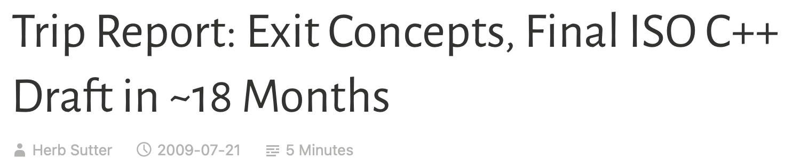
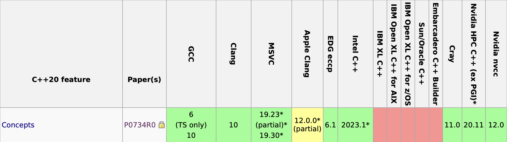
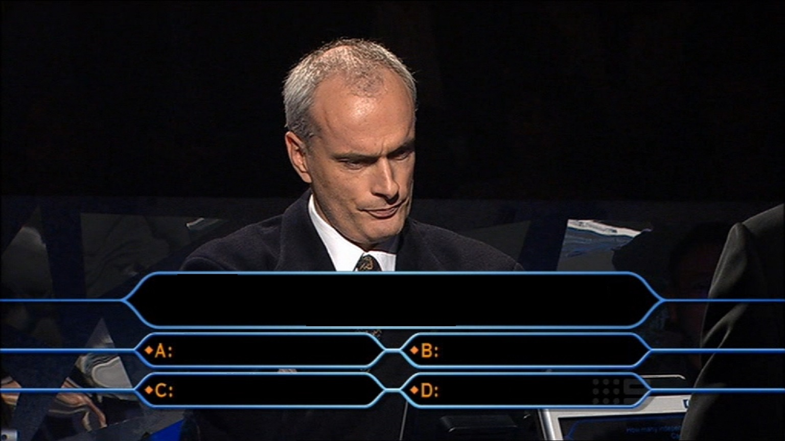

<!-- _paginate: skip  -->
<!-- _class: titlecover -->
<!-- _footer: "" -->


# **Concepts**
## An introduction

Alberto Invernizzi, CSCS (alberto.invernizzi@cscs.ch)

---
# Stroustrup about Templates

<div class="hcenter">

In about 1987, I tried to design templates with proper interfaces. I failed. **I wanted** three properties for templates:

- Full generality/expressiveness
- Zero overhead compared to hand coding
- **Well-specified interfaces**

Then, nobody could figure out how to get all three, so **we got**
- Turing completeness
- Better than hand-coding performance
- Lousy interfaces (basically **compile-time duck typing**)

**The lack of well-specified interfaces led to the spectacularly bad error messages we saw over the years.** The other two properties made templates a run-away success.

<span style="text-align:right; font-size: 23px">

from ["Concepts: The Future of Generic Programming"](https://wg21.link/p0557) in 2017

</span>

</div>

---
<!-- _class: lead -->
# Concepts

<div class="hcenter">
<cite>

“Concepts” is a foundational feature that in the ideal world would have been present in the very first version of templates and the basis for all use.

 (Bjarne Stroustrup in 2017)

</cite>
</div>

---
<!-- _class: lead -->

# What are concepts?

<div class="hcenter">

<center>

"Concepts are a type system for types"
(B. Milewski in [C++ Concepts: a Postmortem](https://bartoszmilewski.com/2010/06/24/c-concepts-a-postmortem/))

</center>

So they offer classic advantages of strongly-typed type systems:

- constrain types
- improve error reporting
- overloading
- self-documenting code

</div>

---
<!-- _class: lead -->

# Once upon a time...

---
<div class="hcenter">

## <!-- fit --> It was early 2000s and `concept` concept was born.

...at least in C++ world, because it was not a completely new idea (e.g. Haskell already had `typeclass`es), but it needed some adaptions/extension for the C++ generic programming problems.

- In **2003** first `concept`s papers come up at WG21
(by Bjarne Stroustrup and Gabriel Dos Reis).

- In **2005** they were driven towards C++0x
with a paper [Concepts for C++0x](https://open-std.org/jtc1/sc22/wg21/docs/papers/2005/n1758.pdf)

- In **2006**, **2007**, **2008** more papers about `concept` and STL (e.g. https://www.stroustrup.com/popl06.pdf)
</div>

---
# Then 2009 came...

<div class="hcenter">

[WG21 July 2009 Meeting(13-18 July 2009)](https://www.open-std.org/jtc1/sc22/wg21/docs/papers/2009/n2920.html) happened, and there has been a discussion about what to do with concepts...

<center>

### TL;DR

</center>



which is the title of a [post](https://herbsutter.com/2009/07/21/trip-report/) from Herb Sutter where he interviewed Bjarne Stroustrup about the "exit" of `concept`s from the C++-0x standard.

</div>

---
<!-- _class: lead -->

<div class="hcenter" style="width:70%">

## <!--fit--> Extent of Stroustrup interview about Concepts C++-0x

**Q**: Were concepts removed because of political reason X, Y, or Z?

**A**: No. [...] The committee decided to **prioritize schedule and ship C++0x sooner** while still leaving the door wide open to also adopt concepts later.

</div>

---
<!-- _class: lead -->

# C++11
### no concepts as per decision in 2009

---
<!-- _class: lead -->

## From 2009 the work (started in 2003) continued...

Actually, from Bjarne Stroustrup words

<cite>

I started to design concepts from scratch in 2009.
In 2011, Alex Stepanov [...] attacked the problem from the user’s perspective: [...]. That re-booted the standards effort based on a new, fundamentally different, and better approach than the C++0x effort.
We now have a ISO TS (“Technical Specification”) for concepts.

</cite>

---
<!-- _class: lead -->

# C++14
### no concepts, but "Concept TS" is ongoing

---

<!-- _class: lead -->

# C++17
### it's time for concepts!!!
["Why I want Concepts, and why I want them sooner rather than later"](http://wg21.link/P0225)

---
<!-- _class: lead -->

# C++17
### ~~it's time for concepts!!!~~ no concepts

See [Why Concepts didn't make it to C++17](https://web.archive.org/web/20181002123639/http://honermann.net/blog/2016/03/06/why-concepts-didnt-make-cxx17/)

---
<!-- _class: lead -->

# 🍾 `concept`s made it in C++20! 🍾

---
# Compiler support

<center>

[cppreference.com C++20 compiler support](https://en.cppreference.com/w/cpp/compiler_support#cpp20)

</center>



---
# Concepts-0x != Concepts

<div class="twocolumns">

<div>

**Stroustrup interview about Concepts C++-0x**

**Q**: Aren’t concepts about adding major new expressive power to the language, and so enable major new kinds of programs or programming styles?

**A**: Not really. **Concepts are almost entirely about getting better error messages**. [...]

Yes, **concepts would add one truly new expressive capability to the language, namely the ability to overload on concepts**. [...]

By far the most visible benefit of concepts lies in **clearer template error messages**, including the **ability to do separate checking** [...].

</div>

<div>

**C++ 20 Concepts**

- 🧐 concepts are almost entirely about getting better error messages.

- ✅ concepts would add one truly new expressive capability to the language, namely the ability to overload on concepts.

- ❌ ability to do separate checking

- ❌ no concept maps

</div>
</div>

---
<!-- _class: lead -->

<div class="hcenter">

What can we do in terms of language expressiveness with Concepts?

- constrain types
- overloading functions
- template class specialization

<center>

**Can't we already do this without Concepts?!**

</center>

- SFINAE
- tag dispatching
- constexpr

# Yes, but...

<center>

</div>

---
<!-- _class: lead -->

# Listen to Bjarne Stroustrup!

<div class="hcenter">

<cite>

Try concepts!
They will dramatically improve your generic programming and make the current workarounds (e.g., traits classes) and low-level techniques (e.g., enable_if – based overloading) feel like error-prone and tedious assembly programming.

</cite>

</div>

---
<!-- _class: lead -->

<div class="hcenter">

Aim of this presentation is not to compare old and new.
The old way is still there and can be useful.

It is just to show how more expressive are concepts and how helpful they can be in producing more readable, straightforward and maintenable code.

</div>

---
<!-- _class: lead -->

# Concepts
(syntax and new language constructs)

---
# Concepts: Placeholder Declaration

<div class="hcenter">

As Milewsky said "concepts is a type-system for types".

Indeed they express something for a type; we can use concepts next to types to constrain them.

```cpp
std::floating_point T
```

Actually, it is a placeholder declaration (like `template <class T>`), which defines constraints over the provided/deducible placeholder.

In the case above it means _"the placeholder `T` is constrained to respect the concept `std::floating_point`"_.

**It seems a very trivial thing, but it is already super powerful and expressive.**

---

<div class="hcenter">

We can use it to declare a named placeholder (e.g. `<class T>`) or an anonymous placeholder (`auto`)

```cpp
template <std::floating_point T>
std::integral auto foo(T a, T b);

std::floating_point auto x = foo(13.26, 3.14);
```

... but we still have to follow their rules.

</div>

<div class="twocolumns">
<div>

<center>

❌ NOT VALID ❌

</center>

```cpp
int foo(std::floating_point U a);

template <class U>
int foo(std::floating_point U a);

template <class R>
std::integral R foo();

std::integral R foo();

std::signed_integral int x = foo(13.26, 3.14);
```

</div>
<div>

<center>

✅ VALID ✅

</center>

```cpp
template <std::integral R, std::floating_point T>
R foo(T a, T b);

template <std::integral R, std::floating_point U>
R foo(std::floating_point auto a, U b);

template <std::floating_point U>
std::integral auto foo(std::floating_point auto a, U b);

int foo(std::floating_point auto a,
        std::floating_point auto b);
```

</div>
</div>

---
<!-- _backgroundColor: lightblue -->

# QUIZ TIME

# What's the difference?

<div class="hcenter">

```cpp
void foo(std::floating_point auto, std::floating_point auto);
```

# vs

```cpp
template <std::floating_point T> void foo(T, T);
```

</div>

---
<!-- _backgroundColor: lightblue -->

# QUIZ TIME

# What's the difference?
<div class="hcenter">

```cpp
std::integral auto foo();
```

# vs

```cpp
template <std::integral R> R foo();
```

<!-- https://godbolt.org/z/vqehcPGdn -->

</div>

---
<!-- _class: lead -->

# [STL Concepts Library](https://en.cppreference.com/w/cpp/concepts)
### <span>en.cppreference.com/w/cpp/concepts</span>

#### (Core, Comparison, Object, Callable, Iterator, Algorithm, Ranges)

---
# Overload

<div class="hcenter">

No need for negated constraints, ad hoc arguments, ... trying to achieve mutual exclusitivity among different overloads.

With concepts there is **partial ordering of overloads**.

It means it is not anymore a matter of enabling/disabling an overload from the overload set, but it is a matter of selecting the most specific one for the use-case among all available valid overloads.

And it applies also to class specialization!

---
<!-- _backgroundColor: lightgreen -->
<!-- _class: lead -->

# EXERCISE

<div class="hcenter">

Fix this snippet using concepts for class specialization.

```cpp
template <class T, class = void>
struct X;

template <class T>
struct X<T, std::enable_if_t<std::is_integral_v<T>>> {
    static constexpr auto value = "integral";
};

template <class T>
struct X<T, std::enable_if_t<std::unsigned_integral<T>>> {
    static constexpr auto value = "unsigned";
};

int main() {
    static_assert(X<int>::value == "integral");
    static_assert(X<unsigned int>::value == "unsigned");
}
```

**SOLUTION** https://godbolt.org/z/P4cG3Yh9W

</div>

---
<!-- _class: lead -->

# Before introducing new keywords...
There is still one thing worth mentioning that can be done without additional keywords

---
# Concepts: true/false checks

<div class="hcenter">

We used concepts for declaring a constrained placeholder, but actually we can use the same concept to check that an instantiated placeholder respects it.

```cpp
std::floating_point<T>
```

yields a `constexpr bool` value, similarly to the good old trait.

This means that we can test that a type respect a concept.

```cpp
static_assert(    std::floating_point<float>);
static_assert(not std::floating_point<int>);
```

which is semantically the same as

```cpp
static_assert(    std::is_floating_point_v<float>);
static_assert(not std::is_floating_point_v<int>);
```

</div>

---
<!-- _backgroundColor: lightgreen -->
<!-- _class: lead -->

# Quick playground or continue?

</div>

---
<!-- _class: lead -->

# Let's introduce new keywords!

---
# `requires` clause

<div class="hcenter">

Till now we used concepts without using any new keyword. Declaring "constrained type placeholder" is not the only way to declare constraints for a type. Actually there are two other ways to express the same constraint using the `requires` keyword.

**Constraining the template**

```cpp
template <class T> requires std::floating_point<T>
T foo(T a, T b) {}
```

Or **constraining the function**
```cpp
template <class T>
T foo(T a, T b) requires std::floating_point<T> {}
```

`requires` clause checks that the given `constexpr` is `true`.

</div>

---
<div class="hcenter">

This means that we can pass to a `require` clause a concept like we did, but also whatever expressions returning `constexpr bool`.

So, we can use a trait
```cpp
template <class T>
void foo() requires std::is_floating_point_v<T>;
```

but also a call to a `constexpr` function

```cpp
template <class T>
void foo(T&& x) requires (std::signbit(-10));
```

or compose a boolean expression

```cpp
template <class T>
requires (std::integral<T> && !std::same_as<char>)
void foo(T&& x);
```

**NOTE**: the constant expression must be a primary expression. It can be easily achieved by parenthesizing an expression.

</div>

---
<!-- _class: lead -->

<div class="hcenter">

Also an **IILE** (aka _"Immediately Invoked Lambda Expression"_) returning a `constexpr bool` is a valid constraint.

```cpp
#include <source_location>

template <class T>
requires (
    [](const auto& line) {
        return line % 2 == 0;
    }(std::source_location::current().line())
)
void foo(T&& x) {
    // foo implementation
}
```

<center>

https://godbolt.org/z/hnWM9PTcr

</center>

</div>

---
<!-- _class: lead -->

# And after `requires` keyword...
# ...we can introduce `requires` keyword

---
# `requires` expression

<div class="hcenter">

Yes, it's the same keyword...but previously we were talking about `requires`-clause, now we are introducing `requires`-expression!

```cpp
requires (parameter-list) {
    requirement_1;
    requirement_2;
    ...
    requirement_n;
}
```

+ `parameter-list` like for functions (optional)
Useful to get "symbolic" entities for the sake of defining requirements.
+ Each requirement has to be **verified** in order for a requirement expression to be true

A `requires`-expression is `true` if all requirements are **verified**, otherwise `false`.

</div>

---
# `requires requires`

<div class="hcenter">

+ `requires`-clause evaluates a boolean expression
+ `requires`-expression returns a boolean value

<center>

💡 Wait... I can combine them! 💡

</center>

```cpp
template <class T, class U>
requires requires {
    ...
    }
void foo(T a, U b) {
}
```

# **...and is it a good idea?**

---
<!-- _class: lead-->

# NO.

---
<!-- _class: lead -->

## `requires requires` is generally a code smell.
It might be better to define a concept for it instead of having something ad-hoc.


---
<!-- _class: lead -->

# For the moment we are forgiven.
Since we don't know (yet) how to define a custom named concept, we can do

<div class="hcenter">

```cpp
template <class T>
requires requires { req_1; req_2; ... }
void foo() {}
```

</div>

---
# `requires`-expression


<div class="twocolumns">

<div>

A `requires`-expression gives us the ability to express a very complex set of constraints.

```cpp
requires (parameter-list) {
    requirement_1;
    requirement_2;
    ...
    requirement_n;
}
```

and all of them must be **verified** at the same time, like if they were joined by an AND.

There are four types of requirements we can write in the body of the `requires`-expression, and for each one **VERIFIED** has a different meaning.

</div>
<div>

1️⃣ **SIMPLE**: does it build?

```cpp
a + b;
std::floating_point<T>;
```

2️⃣ **TYPE**: does it represent a type?

```cpp
typename A<B>;
typename B::type;
```

3️⃣ **COMPOUND**: does it build and return-type respects requirement?

```cpp
{ x + b } noexcept -> std::same_as<T>;
```

4️⃣ **NESTED**: does it evaluate true?

```cpp
requires std::floating_point<T>;
```

</div>
</div>

---
<!-- _class: lead -->
<!-- _backgroundColor: lightblue -->

# QUIZ TIME

<div class="hcenter">

```cpp
#include <iostream>
#include <concepts>

template <class T>
requires requires {
    std::floating_point<T>;
}
void bar() { std::cout << "FLOATING" << std::endl; }

template <class T>
void bar() { std::cout << "GENERIC" << std::endl; }

int main() {
    bar<float>();
    bar<int>();
}
```

```
FLOATING
FLOATING
```

**SOLUTION** https://godbolt.org/z/qWbadfjh1

</div>

---
# Requirement Verification

<div class="hcenter">

<center>

## VALID

</center>

After template arguments substitution, is it a valid expression for the language?

```cpp
std::floating_point<T>;
```

# vs

<center>

## TRUE

</center>

After template arguments substitution, is the expression `true`?

```cpp
requires std::floating_point<T>;
```

</div>

---
<!-- _backgroundColor: lightblue -->

# QUIZ TIME

<div class="hcenter">

In a compound requirement

```cpp
{expression} noexcept -> return-type-requirement;
```

`noexcept` and "return-type requirement" are optional

So we can have

<div class="twocolumns">

<div>

**compound requirement**

```cpp
{ expression };
```

</div>
<div>

**simple requirement**

```cpp
expression;
```

</div>
</div>

<center>

## What is the difference?

**SOLUTION** https://eel.is/c++draft/expr.prim.req.compound#2

</center>

</div>

---
# `requires`-expression parameter list

<div class="hcenter">

<cite>

A `requires`-expression can introduce local parameters using a parameter list. These parameters have no linkage, storage, or lifetime; they are only used as notation for the purpose of defining requirements.

</cite>

```cpp
requires (T a, T b) {
    { a == b } -> std::same_as<bool>;
};
```

Parameter list is somehow a shortand list of `declval`s you might want to use for requirement definition.

```cpp
requires {
    { declval<const T&>() == declval<const T&>() } -> std::same_as<bool>;
};
```

...and equivalently to `declval`, you can use them in unevaluated context (e.g. check type, check if builds) but not in evaluated context (because they don't actually exist).

</div>

---
<!-- _class: lead -->

# How to define a new custom named concept
and forget about about the horrendous `requires requires` construct

---
# `concept` keyword

<div class="hcenter">

Till now we used already defined concepts, all the ones already available in STL. But we can define our ones!

```cpp
template <class>
concept concept_name = bool_expression;
```

This defines a **named concept** where `bool_expression` can be whatever returns a `constexpr bool` value:

- a boolean expression of concepts
- `type_trait`
- IILE
- ...

<center>

## ... or a `requires`-expression!

</center>

</div>

---
<!-- _backgroundColor: lightblue -->

# QUIZ TIME

<div class="hcenter">

<center>

**What does this concept requires on X?**

</center>

```cpp
template <class X>
concept ??? = requires (X t) {
    []<class... Args>(const std::tuple<Args...>&) {}(t);
};
```

1. What type of requirement is used in the `requires`-expression?
_simple, type, compound, nested, ..._

2. What does it mean to be valid for that type of requirement?
   - "it builds"
   - "it is true"

3. What is it technically checking?
_"If I have `X t` and I pass it to the lambda function..."_

1. What does it implies?
_"If it builds, `X` has to be ..."_

</div>

---
<!-- _backgroundColor: lightgreen -->

# EXERCISE

<div class="hcenter">

**1. Define a concept for a `vector2d`, whose requirements are:**
- you should be able to access its members as `x` and `y`
- the type used for members should be a number. `bool` and `char` should not be considered valid. Pointers and reference neither.
- `x` and `y` cannot have different types

**2. Now define `vector3d` concept "extending" previous one.**

<center>

**SOLUTION** https://godbolt.org/z/7GMvWcdn6

</center>

</div>

---
<!-- _class: lead -->
<!-- _backgroundColor: lightgreen -->

# EXERCISE

<div class="hcenter">

**Invocable with tuple**:  Define a concept which checks if a function is callable with arguments contained in a tuple.

```cpp
void foo(const int&, float);

static_assert(    invocable_with_tuple_args<foo, std::tuple<int, float>>);
static_assert(not invocable_with_tuple_args<foo, std::tuple<int, std::string>>);
```

Try implementing it using
- `std::apply`
- `std::invocable`
- `std::convertible_from` on each argument


https://godbolt.org/z/E3rE4bcMq

</div>

---
# Concepts & Partial Order

<div class="hcenter">

Do you remember when we talked about partial ordering of overloads?

Concepts are partially ordered, which means that compiler can realise if a concept A subsumes a concept B.

How can it infer that? It normalises concept to a sequence of and/or between atomic constraints, then it does the logic comparison to know if the two normalised concepts are related.

There is just one pitfall: two atomic constraints are considered equivalent if and only if they are formed from the same expression at source level.

</div>

---
<!-- _class: lead -->

# Concepts & Partial Order

<div class="hcenter">

```cpp
template <class T> concept incrementable = requires (T x) { x++; ++x; };
template <class T> concept decrementable = requires (T x) { x--; --x; };

template <class T>          constexpr auto foo() { return 1; }
template <incrementable T>  constexpr auto foo() { return 2; }
template <decrementable T>  constexpr auto foo() { return 3; }

template <class T> requires requires (T a) { a++; ++a; a--; --a; }
// template <class T> requires (incrementable<T> && decrementable<T>)
constexpr auto foo() { return 3; }

struct JustPlus {
    JustPlus& operator++(int) {return *this; }
    JustPlus& operator++() { return *this; }
};

int main() {
    static_assert(foo<std::string>()   == 1);
    static_assert(foo<JustPlus>()   == 2);
    static_assert(foo<int>()        == 3); // error
}
```

https://godbolt.org/z/j35db776W

</div>

---
<!-- _class: lead -->
# Concepts and Errors
Do concepts improve error messages?

---

<!-- _class: lead -->

There's an error in the code below... 🧐

<div class="hcenter">

```cpp
#include <vector>
#include <algorithm>

template <class T>
void sort(std::vector<T>& values) {
    std::sort(values.begin(), values.end());
}

struct Num {
    Num(long long v) : value_(v) {}
    long long value_;
};

int main() {
    std::vector<int> v_int{4,6,2,5}; sort(v_int);
    std::vector<Num> v_num{4,6,2,5}; sort(v_num);
}
```

</div>

---
<!-- _class: lead -->

# Where do we start from? SFINAE errors

<div class="hcenter">

That small snippet can produce hundreds of lines of errors.

<center>

|Compiler|Output|
|-|-|
|GCC 14.2|138 lines of output|
|Clang 18.1.0|245 lines of output (9 errors)|

</center>

Moreover, some knowledge about what it is trying to be instantiated and about the internals of the algorithm is required in order to be able to follow the template instantiation stack.

</div>

---

<div class="hcenter">

# <!--fit--> Why concepts should improve error messages?

The idea is that **errors were detected too late** with plain templates. Indeed, with templates the full instantiation stack is created and if it turns out to be an error, the compiler dumps out all of it.

Adding a constraint **with concepts**, beside being easier than before which encourages the good practice of constraining templates, **it creates earlier error "detection" points in the instantiation stack**. Moreover, it is also an explicit requirement.

</div>

---
<!-- _class: lead -->

## GCC

```cpp
<source>: In function 'int main()':
<source>:20:11: error: no matching function for call to 'sort(std::vector<Num>&)'
   20 |     ::sort(v_num);
      |     ~~~~~~^~~~~~~
<source>:8:6: note: candidate: 'template<class T>  requires  comparable<T> void sort(std::vector<T>&)'
    8 | void sort(std::vector<T>& values) {
      |      ^~~~
<source>:8:6: note:   template argument deduction/substitution failed:
<source>:8:6: note: constraints not satisfied
<source>: In substitution of 'template<class T>  requires  comparable<T> void sort(std::vector<T>&) [with T = Num]':
<source>:20:11:   required from here
   20 |     ::sort(v_num);
      |     ~~~~~~^~~~~~~
<source>:5:9:   required for the satisfaction of 'comparable<T>' [with T = Num]
<source>:5:22:   in requirements with 'const T& a', 'const T& b' [with T = Num]
<source>:5:60: note: the required expression '(a < b)' is invalid, because
    5 | concept comparable = requires (const T& a, const T& b) { a < b; };
      |                                                          ~~^~~
<source>:5:60: error: no match for 'operator<' (operand types are 'const Num' and 'const Num')
Compiler returned: 1
```

---
<!-- _class: lead -->

## CLANG

```cpp
<source>:20:5: error: no matching function for call to 'sort'
   20 |     ::sort(v_num);
      |     ^~~~~~
<source>:14:6: note: candidate template ignored: constraints not satisfied [with T = Num]
   14 | void sort(std::vector<T>& values) {
      |      ^
<source>:13:29: note: because 'Num' does not satisfy 'comparable'
   13 | template <class T> requires comparable<T>
      |                             ^
<source>:5:60: note: because 'a < b' would be invalid: invalid operands to binary expression ('const Num' and 'const Num')
    5 | concept comparable = requires (const T& a, const T& b) { a < b; };
      |                                                            ^
1 error generated.
Compiler returned: 1
```

---
<div class="hcenter">

This is how the code was changed for constraining the type

```cpp
template <class T>
concept comparable = requires (const T& a, const T& b) { a < b; };

template <class T> requires comparable<T>
void sort(std::vector<T>& values) {
    std::sort(values.begin(), values.end());
}
```

And this is another selling point for concepts: it is not a "go big or go home" solution.

Indeed you can start using them in your codebase wherever you need them without a need for a full upgrade of you codebase. This is a very useful thing, because **they allow a smooth transition** at your pace, and IMHO it encourages adoption (if you can use c++20).

</div>

---
<!-- _class: lead -->

This was a very simple example.
The output is not always as nice as in this case or as we would like it to be.

But at least with concepts we have a way to break the chain of template instantiation, in an expressive way.

---
<!-- _class: lead -->

# Concepts in reality

---
<!-- _class: lead -->

# CRTP vs Concepts

<div class="twocolumns">

<div>

```cpp
template <class T>
struct Shape {
    void draw() const {
        static_cast<const T*>(this)->draw();
    }
};

struct Torus : Shape<Torus> {
    void draw() const {
        std::cout << "TORUS";
    }
};

struct Cylinder : Shape<Cylinder> {
    void draw() const {
        std::cout << "CYLINDER";
    }
};
```

</div>

<div>

```cpp
template <class T>
concept Drawable = requires (T shape, const T& cshape) {
    cshape.draw();
};

struct Torus {
    void draw() const {
        std::cout << "TORUS";
    }
};

struct Cylinder {
    void draw() const {
        std::cout << "CYLINDER";
    }
};
```

</div>

</div>

- CRTP makes you decide if you want to "adopt" the interface, while with concepts it is "adopted" by default. Syntactically is correct, but semantically might not have sense.
- with CRTP you can inject function in the interface, while with concept you can just have "free functions"
- Previous point opens to a potential ADL issue: a user that defines a new type compatible with your library concept, cannot use free functions easily (either fully qualified name or some namespace workaround)

---
# `if constexpr`

<div class="hcenter">

This is another usage that starting from C++17 it has become common, and concepts can be helpful there too.

```cpp
template <class T>
struct P2D { T x, y; };

template <class T>
struct P3D : P2D<T> { T z; };

template <class T>
void print(const T& pt) {
    std::cout << "(" << pt.x << ", " << pt.y;
    if constexpr (requires { pt.z; })
        std::cout << ", " << pt.z;
    std::cout << ")" << std::endl;
}
```

</div>

---
# Conclusions

- **Are they nice?**
Yes
- **Are they the best we could have ever had?**
No (e.g. concept maps...)
- **Do they improve error messages?**
Yes and No.
- **Is it worth starting using them?**
Yes, they simplify meta-programming in a lot of situations, improving code readability and expressiveness. Moreover it makes the code self-documenting.
- **Is it a "go big or stay home" solution?**
Not at all! They allow a very smooth transition. You can start even just by partially using them mixed with other solutions (e.g. same function/class overloaded/specialised with both old methods and concepts).

---
<!-- _class: lead -->

# Q&A

Alberto Invernizzi
Research Software Engineer @ CSCS

---
<!-- _class: lead -->
# BONUS

---


<h1 style="position: absolute; left: 0; top: 58%; text-align: center; color: white; width: 100%; font-size: 44pt">

How can you specify cv-qualified concepts?

</h1>

---
<!-- _class: lead -->
<style scoped>
    div.answer-block {
        position: absolute;
        bottom: 3%;
        width: 93%;

        background: white;

        display: grid;
        grid-template-columns: repeat(2, minmax(0, 1fr));
        gap: 1rem;
    }

    div > pre {
        text-align: center;
        font-size: 35pt;
        margin: 10px;
    }
</style>


<div class="answer-block">

<div>

```cpp
const Concept auto & name
```

```cpp
const Concept auto * const name
```

```cpp
Concept const auto & name
```

</div>

<div>

```cpp
Concept auto const & name
```

```cpp
Concept auto & const name
```

```cpp
Concept auto * const name = &val;
```

</div>
</div>

---


# <!--fit--> How can you specify cv-qualified concepts?

<div class="twocolumns">

<div>

```cpp
✅ const Concept auto & name
```

```cpp
✅ const Concept auto * const name
```

```cpp
❌ Concept const auto & name
```

</div>
<div>

```cpp
✅ Concept auto const & name
```

```cpp
❌ Concept auto & const name
```

```cpp
✅ Concept auto * const name
```

</div>

</div>

**HINTS**
- `const` applies to the full type
(type, or concept + placeholder)
- constraint helps defining the type, soconcept and placeholder should be considered as a single thing
(i.e. concept and placeholder cannot be split apart)

---
<!-- _class: lead -->

# Concepts vs Parameter Pack

---
# Concepts vs Parameter Pack

<div class="hcenter">

```cpp
#include <concepts>

template <class... Args>
concept AtLeast2 = requires sizeof...(Args) >= 2;

template <AtLeast2... Args>
void foo(Args&&...) {}

int main() {
    foo(1, 2);  // error: AtLeast2<int>
}
```

With the syntax
```cpp
template <Concept... Placeholder>
```
we're applying the type constraint to each single type of the parameter pack, **NOT** to the parameter pack as a whole.

</div>

---
# Concepts vs Parameter Pack

<div class="hcenter">

```cpp
#include <concepts>

template <class... Args>
concept AtLeast2 = requires sizeof...(Args) >= 2;

template <class... Args>
requires AtLeast2<Args...>
void foo(Args&&...) {}

int main() {
    // foo(1);     // error: as per requirement
    foo(1, 2);
}
```

Now we are requiring that the full parameter pack `Args...` respect the concept `AtLeast2`.

</div>
