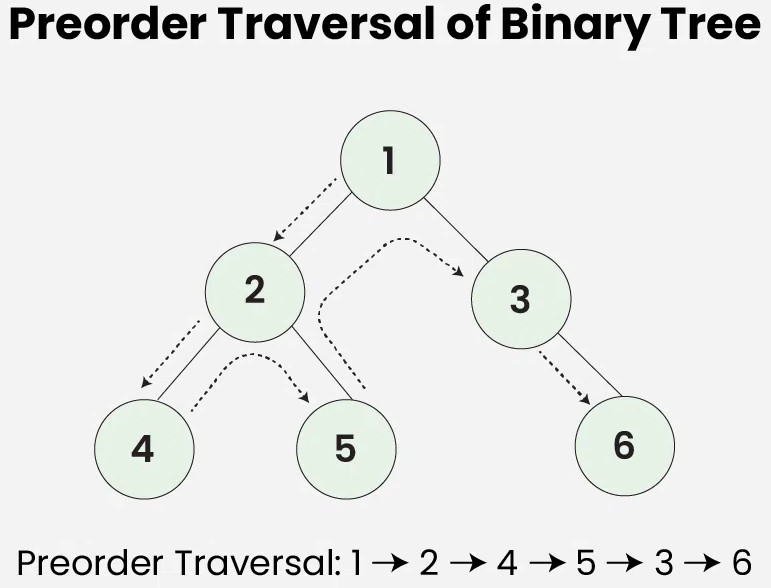

# **C++ Course 2024**

<!-- _paginate: skip  -->
<!-- _class: titlecover -->
<!-- _footer: "" -->

### Explicit Object Parameters

#### CSCS

---

# Explicit Object Parameters: a new C++23 language feature


<div class="twocolumns">
<div>

(const-) reference qualified member functions

```c++
struct A {
    int& foo(...) &;
    int const& foo(...) const &;
    int&& foo(...) &&;
    int const&& foo(...) const &&;
};
```


</div>
<div>

explicit parameter for self-reference

```c++
struct A {
    int& foo(this A& self, ...);
    int const& foo(this A const& self, ...);
    int&& foo(this A&& self, ...);
    int const&& foo(this A const&& self, ...);
};
```

</div>
</div>

- can also be used for additonal `volatile` constraint

<div class="twocolumns">
<div>

- access to member variables:

</div>
<div>

```c++
int& A::foo(this A& self, ...) { return self.m; }

int&& A::foo(this A&& self, ...) { return std::move(self.m); }
```

</div>
</div>

<div class="twocolumns">
<div>

- pass self by value?

</div>
<div>

```c++
struct A {
    int& foo(this A self, ...);
};
```

</div>
</div>

---

# Deducing `this` for de-quadruplication

```c++
struct A {
    template<typename Self>
    auto&& foo(this Self&& self, ...) {
        return std::forward<Self>(self).m_;
    }
    int m_;
};
```
- one function declaration and definition!
- self parameter is deduced
- return type is deduced: `auto&&`, or `auto foo(this Self&& self) -> decltype(auto)`
- helper functions: `std::forward_like` for returning the correct type:

```c++
template<typename Self>
auto&& foo(this Self&& self, ...) {
    return std::forward_like<Self>(self.m_);
}
```

---

# Deducing `this` for derived types

<div class="twocolumns">
<div>

```c++
struct base {
    int m_;

    auto foo(this base const& self) { return self.m_; }

    template<typename Self>
    auto bar(this Self const& self) { return self.m_; }

    template<typename Self>
    auto baz(this Self const& self) { return self.base::m_; }
};

struct derived : base {
    int m_;
};

auto main() -> int {
    base b{42};
    std::println("b.foo() = {}", b.foo());
    std::println("b.bar() = {}", b.bar());
    std::println("b.baz() = {}", b.baz());

    derived d{{42}, 99};
    std::println("d.foo() = {}", d.foo());
    std::println("d.bar() = {}", d.bar());
    std::println("d.baz() = {}", d.baz());
}
```

</div>
<div>


</div>
</div>

---

# Deducing `this` for derived types

<div class="twocolumns">
<div>

```c++
struct base {
    int m_;

    auto foo(this base const& self) { return self.m_; }

    template<typename Self>
    auto bar(this Self const& self) { return self.m_; }

    template<typename Self>
    auto baz(this Self const& self) { return self.base::m_; }
};

struct derived : base {
    int m_;
};

auto main() -> int {
    base b{42};
    std::println("b.foo() = {}", b.foo()); // base const &
    std::println("b.bar() = {}", b.bar()); // base const &
    std::println("b.baz() = {}", b.baz()); // base const &

    derived d{{42}, 99};
    std::println("d.foo() = {}", d.foo()); // base const &
    std::println("d.bar() = {}", d.bar()); // derived const &
    std::println("d.baz() = {}", d.baz()); // derived const &
}
```

</div>
<div>

- template type deduction remains unchanged
- Self: statically most derived type
- output:
```bash
b.foo() = 42
b.bar() = 42
b.baz() = 42
d.foo() = 42
d.bar() = 99
d.baz() = 42

```

</div>
</div>

---

# Deducing `this` for Curiously Recurring Template Pattern

<div class="twocolumns">
<div>

```c++
template<class T>
struct add_postfix_increment {
    auto operator++(int) {
        auto& this_ = static_cast<T&>(*this);
        auto tmp = this_;
        ++this_;
        return tmp;
    }
};
struct A : add_postfix_increment<A> {
    using add_postfix_increment<A>::operator++;
    A& operator++() { ++m_; return *this; }
    int m_ = 0;
};
```

</div>
<div>

- templated base class (template parameter is derived class)
- static cast to derived type
- recurring: derived class inherits from base templated on itself

</div>
</div>

---

# Deducing `this` for Curiously Recurring Template Pattern

<div class="twocolumns">
<div>

```c++
template<class T>
struct add_postfix_increment {
    auto operator++(int) {
        auto& this_ = static_cast<T&>(*this);
        auto tmp = this_;
        ++this_;
        return tmp;
    }
};
struct A : add_postfix_increment<A> {
    using add_postfix_increment<A>::operator++;
    A& operator++() { ++m_; return *this; }
    int m_ = 0;
};
```

</div>
<div>

- templated base class (template parameter is derived class)
- static cast to derived type
- recurring: derived class inherits from base templated on itself

</div>
</div>

<div class="twocolumns">
<div>

```c++
struct add_postfix_increment {
    template<typename Self>
    auto operator++(this Self&& self, int) {
        auto tmp = self;
        ++self;
        return tmp;
    }
};
struct A : add_postfix_increment {
    using add_postfix_increment::operator++;
    A& operator++() { ++m_; return *this; }
    int m_ = 0;
};
```

</div>
<div>

- no more templates (non-template base class)
- no casts
- no recursion

</div>
</div>

---

# Deducing `this` for constraining derived types

<div class="twocolumns">
<div>

```c++
struct add_postfix_increment {
    template<typename Self>
    auto operator++(this Self&& self, int) {
        auto tmp = self;
        ++self;
        return tmp;
    }
};
struct A : add_postfix_increment {
    using add_postfix_increment::operator++;
    A& operator++() { ++m_; return *this; }
    int m_ = 0;
};
```

- `A` should only be able to inherit from `add_postfix_increment` if it fulfills the interface
- Print a human-readable error message if this is not the case

</div>
<div>


</div>
</div>

---

# Deducing `this` for constraining derived types

<div class="twocolumns">
<div>

```c++
struct add_postfix_increment {
    template<typename Self>
    auto operator++(this Self&& self, int) {
        auto tmp = self;
        ++self;
        return tmp;
    }
};
struct A : add_postfix_increment {
    using add_postfix_increment::operator++;
    A& operator++() { ++m_; return *this; }
    int m_ = 0;
};
```

- `A` should only be able to inherit from `mixin` if it fulfills the interface
- Print a human-readable error message if this is not the case

</div>
<div>

```c++
struct add_postfix_increment {
    template<typename Self> requires requires(Self&& self) {
        {++self}->std::convertible_to<std::remove_cvref_t<Self>>;}
    auto operator++(this Self&& self, int) {
        auto tmp = self;
        ++self;
        return tmp;
    }
};
struct A : add_postfix_increment {
    using add_postfix_increment::operator++;
    A& operator++() { ++m_; return *this; }
    int m_ = 0;
};
```

- Wherever we have templates, we can use concepts!

</div>
</div>

---

# Deducing `this` for lambdas

<div class="twocolumns">
<div>

```c++
auto fib = [](this auto self, int n) {
    if (n<2) return n;
    return self(n-1) + self(n-2);
};
```

- same syntax for lambdas
- reference lambda from within lambda
- recursion!
- `this` in lambda body still refers to the captured object
</div>
<div>

- get type of lambda
```c++
auto lambda = []<typename Lambda>(this Lambda&& self, int n) {
    using type = std::remove_cvref_t<Lambda>;
};
```


- constrain value category
```c++
auto lambda = [](this auto& self, int n) {
    std::println("{}", n);
};
decltype(lambda){}(42); // compile error
```

- `mutable` cannot be used anymore
```c++
int m = 0;
auto lambda = [m](this auto& self, int n) {
    m = n;
    std::println("{}", m);
};
lambda(42);
```

</div>
</div>

<!--
---

# Deducing `this` for recursive lambdas

-->
---

# Simplifying the visitor pattern: simple calculator

<div class="twocolumns">
<div>

> ***
> The Visitor Pattern encapsulates an operation
> executed on an object hierarchy as an object
> and enables it to define new operations without
> changing the object hierarchy. (Rainer Grimm)
> ***

- uses double dispatch
    - visitor gets passed to object via accept member function
    - visitor will be invoked in the body with the object as parameter
- uses virtual function calls
- complicated

</div>
<div>

- goal: write a simple calculator
    - only doubles
    - only add and subtract operations
- assume: parser is supplying us with expression tree

```c++
// 3 + 4 - 5 = 2
auto expr =
    make_expression<sum_expression>(
        make_expression<number_expression>(3),
        make_expression<difference_expression>(
            make_expression<number_expression>(4),
            make_expression<number_expression>(5)
        )
    );
```

- use visitor pattern for traversing expression tree

</div>
</div>

---

## Classical Visitor Pattern

<div class="twocolumns">
<div>

- runtime polymorphic (virtual)
- hierarchy of classes to visit

</div>
<div>

- each expression must accept the visitor
- and call the visit member function

</div>
</div>

<div class="twocolumns">
<div>

```c++
struct expression;
struct number_expression;
struct binary_expression;
struct sum_expression;
struct difference_expression;

struct visitor {
    virtual void visit(number_expression&) = 0;
    virtual void visit(binary_expression&) = 0;
    virtual void visit(sum_expression&) = 0;
    virtual void visit(difference_expression&) = 0;
};

struct expression {
    virtual void accept(visitor&) = 0;
    virtual ~expression() = default;
};
using expression_ptr = std::unique_ptr<expression>;

template<typename T, typename... Args>
auto make_expression(Args&&... args) {
    return std::make_unique<T>(std::forward<Args>(args)...);
}
```

</div>
<div>

```c++
struct number_expression : expression {
    number_expression(double v) :  value_{v} {}
    virtual void accept(visitor& v) override { v.visit(*this); }
    double value_;
};

struct binary_expression : expression {
    binary_expression(expression_ptr lhs, expression_ptr rhs) :
        lhs_{std::move(lhs)}, rhs_{std::move(rhs)} {}
    expression_ptr lhs_;
    expression_ptr rhs_;
    double left_value_ = 0;
    double right_value_ = 0;
};

struct sum_expression : binary_expression {
    using binary_expression::binary_expression;
    virtual void accept(visitor& v) override { v.visit(*this); }
};

struct difference_expression : binary_expression {
    using binary_expression::binary_expression;
    virtual void accept(visitor& v) override { v.visit(*this); }
};
```

</div>
</div>

---

## Classical Visitor Pattern

<div class="twocolumns">
<div>

```c++
struct calculator : visitor {
    void visit(number_expression& e) override {
        stack_.push(e.value_);
    }

    void visit(binary_expression& e) override {
        e.lhs_->accept(*this);
        e.rhs_->accept(*this);
        e.right_value_ = stack_.top();
        stack_.pop();
        e.left_value_ = stack_.top();
        stack_.pop();
    }

    void visit(sum_expression& e) override {
        visit(static_cast<binary_expression&>(e));
        stack_.push(e.left_value_ + e.right_value_);
    }

    void visit(difference_expression& e) override {
        visit(static_cast<binary_expression&>(e));
        stack_.push(e.left_value_ - e.right_value_);
    }

    std::stack<double> stack_;
};
```

</div>
<div>

```c++
void calculate(auto& expr) {
    calculator calc;
    calc.visit(*expr);
    std::println("result = {}", calc.stack_.top());
}
```

- abstract base visitor class
    - must change if we add for example `product_expression`
- virtual function overhead
- double dispatch
- boilerplate accept member functions
- hard to reason about


</div>
</div>

---

## Overload Pattern with deducing `this`

<div class="twocolumns">
<div>

- overload pattern: modern "visitor pattern" in C++23
- uses variadic templates and `std::variant`
- no virtual function calls
- no explicit double dispatch
- no accept member functions
- simpler to understand

```c++
struct number_expression;
struct sum_expression;
struct difference_expression;

using expression = std::variant<
    number_expression, sum_expression, difference_expression>;

using expression_ptr = std::unique_ptr<expression>;

template<typename T, typename... Args>
auto make_expression(Args&&... args) {
    return std::make_unique<expression>(
        std::in_place_type<T>, std::forward<Args>(args)...);
}
```

</div>
<div>

```c++
struct number_expression {
    number_expression(double v) :  value_{v} {}
    double value_;
};

struct binary_expression {
    binary_expression(expression_ptr lhs, expression_ptr rhs) :
        lhs_{std::move(lhs)}, rhs_{std::move(rhs)} {}
    expression_ptr lhs_;
    expression_ptr rhs_;
    double left_value_ = 0;
    double right_value_ = 0;
};

struct sum_expression {
    sum_expression(expression_ptr lhs, expression_ptr rhs) :
        impl_{std::move(lhs), std::move(rhs)} {}
    binary_expression impl_;
};

struct difference_expression {
    difference_expression(expression_ptr lhs, expression_ptr rhs) :
        impl_{std::move(lhs), std::move(rhs)} {}
    binary_expression impl_;
};
```

</div>
</div>

---

## Overload Pattern with deducing `this`

<div class="twocolumns">
<div>

```c++
template<typename... Ts> struct overloaded : Ts... {
    using Ts::operator()...; };

void calculate(auto& expr) {
    std::stack<double> stack_;

    overloaded calculator {
        [&](number_expression& e) { stack_.push(e.value_); },
        [&](this auto& self, sum_expression& e) {
            self(e.impl_);
            stack_.push(e.impl_.left_value_+e.impl_.right_value_);
        },
        [&](this auto& self, difference_expression& e) {
            self(e.impl_);
            stack_.push(e.impl_.left_value_-e.impl_.right_value_);
        },
        [&](this auto& self, binary_expression& e) {
            std::visit(self, *e.lhs_);
            std::visit(self, *e.rhs_);
            e.right_value_ = stack_.top();
            stack_.pop();
            e.left_value_ = stack_.top();
            stack_.pop();
        },
    };
    std::visit(calculator, *expr);
    std::println("result = {}", stack_.top());
}
```

</div>
<div>

- `overloaded`: variadic template class
- inherits from its template parameters
- makes base classes call operators visible as overloads
- can be initialized without spelling out templates (CTAD)
    - Template types deduced from lambda initializers
- deducing `this`in lamdas:
    - `decltype(self)` = `overloaded&` -> most statically derived type

</div>
</div>

---

# Overload Pattern with deducing `this` for Tree traversal

<div class="twocolumns">
<div>

```c++
struct node;
using sentinel = std::monostate;
using tree = std::variant<sentinel, node*>;
struct node { int data; tree left; tree right; };

template <typename... Ts> struct overloaded : Ts... {
    using Ts::operator()...; };

auto preorder_traversal = [](tree const& t, auto&& f) {
    std::visit(
        overloaded{
            [ ] (sentinel const&) {}, // do nothing
            [&] (this auto self, node const* n) {
                f(*n);
                std::visit(self, n->left);
                std::visit(self, n->right);
            }
        },
        t
    );
};
```

</div>
<div>



```c++
auto n6 = node{6, {   }, {   }};
auto n3 = node{3, {   }, {&n6}};
auto n4 = node{4, {   }, {   }};
auto n5 = node{5, {   }, {   }};
auto n2 = node{2, {&n4}, {&n5}};
auto n1 = node{1, {&n2}, {&n3}};
preorder_traversal(tree{&n1},
    [](node const& n) { std::println("{}", n.data); });
```

</div>
</div>

---

# Deducing `this` for handling captured variables

- problem: perfect-forwarding captured values based on whether lambda is l- or r-value

<div class="twocolumns">
<div>

```c++
template<typename Func>
struct factory {
    int i_;
    Func create_;

    template<typename Self>
    auto make(this Self&& self) {
        return std::forward<Self>(self).create_(self.i_); }
};

struct A {
    int m_;
    std::vector<int> v_;
};

template<typename Lambda>
void test(Lambda&& create) {
    factory f{42, std::forward<Lambda>(create)};
    auto a = f.make();             // from lvalue, reuse lambda
    auto b = std::move(f).make(); // from rvalue, consume capture
}
```

</div>
<div>


</div>
</div>

---

# Deducing `this` for handling captured variables

- problem: perfect-forwarding captured values based on whether lambda is l- or r-value

<div class="twocolumns">
<div>

```c++
template<typename Func>
struct factory {
    int i_;
    Func create_;

    template<typename Self>
    auto make(this Self&& self) {
        return std::forward<Self>(self).create_(self.i_); }
};

struct A {
    int m_;
    std::vector<int> v_;
};

template<typename Lambda>
void test(Lambda&& create) {
    factory f{42, std::forward<Lambda>(create)};
    auto a = f.make();            // from lvalue, reuse lambda
    auto b = std::move(f).make(); // from rvalue, consume capture
}
```

</div>
<div>

- without deduced lambda type: cannot determine if it is safe to move
```c++
test(
    [msg = std::vector{1,2,3,4,5,6}]
    (int i)->A {
        return {i, msg}; // std::move?
    });
```

- with deduced lambda type: perfect forwarding
```c++
test(
    [msg = std::vector{1,2,3,4,5,6}]<typename Self>
    (this Self&&, int i)->A {
        return {i, std::forward_like<Self>(msg)};
    });
```

</div>
</div>

---

# Explicit copy by value for chaining computations

- goal: chain computations using member functions
- example: vector class with
    - `sorted()`: return sorted instance
    - `negated()`: return instance with each element negated

```c++
auto v1 = my_vector{{1,2,3,4,5,6,7,8}}.sorted();
auto v2 = my_vector{{1,2,3,4,5,6,7,8}}.sorted().negated();
auto v3 = v1.negated();
```

---

# Explicit copy by value for chaining computations

- with free functions version 1:

<div class="twocolumns">
<div>

```c++
template<typename Compare>
auto sorted(my_vector v) { // pass v by value
    std::sort(v.begin(), v.end());
    return v; // no RVO!
}

auto negated(my_vector v) { // pass v by value
    std::transform(v.begin(), v.end(), v.begin(),
        [](this auto, auto const& x) noexcept { return -x; });
    return v; // no RVO!
}

auto v1 = sorted(my_vector{1,2,3,4,5,6,7,8});
auto v2 = negated(sorted(my_vector{1,2,3,4,5,6,7,8}));
auto v3 = negated(v1);
```

</div>
<div>

```
v1:
my_vector::my_vector{1,2,3,4,5,6,7,8}
my_vector::my_vector(my_vector&&)

v2:
my_vector::my_vector{1,2,3,4,5,6,7,8}
my_vector::my_vector(my_vector&&)
my_vector::my_vector(my_vector&&)

v3:
my_vector::my_vector(my_vector const&)
my_vector::my_vector(my_vector&&)
```

- pass r-value: OK
- pass l-value: Additional move constructor (no RVO)

</div>
</div>

---

# Explicit copy by value for chaining computations

- with free functions version 2:

<div class="twocolumns">
<div>

```c++
template<typename Vector>
requires (/* restrict to only my_vector types */)
auto sorted(Vector&& v) { // pass by universal reference
    auto tmp = std::forward<Vector>(v);
    std::sort(tmp.begin(), tmp.end());
    return tmp; // RVO!
}

template<typename Vector>
requires (/* restrict to only my_vector types */)
auto negated(Vector&& v) { // pass by universal reference
    auto tmp = std::forward<Vector>(v);
    std::transform(tmp.begin(), tmp.end(), tmp.begin(),
        [](this auto, auto const& x) noexcept { return -x; });
    return tmp; // RVO
}

auto v1 = sorted(my_vector{1,2,3,4,5,6,7,8});
auto v2 = negated(sorted(my_vector{1,2,3,4,5,6,7,8}));
auto v3 = negated(v1);
```

</div>
<div>

```
v1:
my_vector::my_vector{1,2,3,4,5,6,7,8}
my_vector::my_vector(my_vector&&)

v2:
my_vector::my_vector{1,2,3,4,5,6,7,8}
my_vector::my_vector(my_vector&&)
my_vector::my_vector(my_vector&&)

v3:
my_vector::my_vector(my_vector const&)
```

- pass r-value: OK
- pass l-value: OK

</div>
</div>

---

# Explicit copy by value for chaining computations

- with member functions (traditional):

<div class="twocolumns">
<div>

```c++
struct my_vector : std::vector<int> {
    using std::vector<int>::vector;

    auto sorted() {
        // ?
    }

    auto negated() {
        // ?
    }
}
```

</div>
<div>

</div>
</div>

---

# Explicit copy by value for chaining computations

- with member functions (traditional):

<div class="twocolumns">
<div>

```c++
struct my_vector : std::vector<int> {
    using std::vector<int>::vector;
    auto sorted() & {
        auto tmp = *this;
        std::sort(tmp.begin(), tmp.end());
        return tmp;
    }
    auto sorted() && {
        auto tmp = std::move(*this);
        std::sort(tmp.begin(), tmp.end());
        return tmp;
    }
    auto negated() & {
        auto tmp = *this;
        std::transform(tmp.begin(), tmp.end(), tmp.begin(),
            [](this auto, auto const& x) noexcept {return -x;});
        return tmp;
    }
    auto negated() && {
        auto tmp = std::move(*this);
        std::transform(tmp.begin(), tmp.end(), tmp.begin(),
            [](this auto, auto const& x) noexcept {return -x;});
        return tmp;
    }
};
```

</div>
<div>

```c++
auto v1 = my_vector{{1,2,3,4,5,6,7,8}}.sorted();
auto v2 = my_vector{{1,2,3,4,5,6,7,8}}.sorted().negated();
auto v3 = v1.negated();
```

```
v1:
my_vector::my_vector{1,2,3,4,5,6,7,8}
my_vector::my_vector(my_vector&&)

v2:
my_vector::my_vector{1,2,3,4,5,6,7,8}
my_vector::my_vector(my_vector&&)
my_vector::my_vector(my_vector&&)

v3:
my_vector::my_vector(my_vector const&)
```

- pass r-value: OK
- pass l-value: OK

</div>
</div>

---

# Explicit copy by value for chaining computations

- with member functions (pass `this` by value):

<div class="twocolumns">
<div>

```c++
struct my_vector : std::vector<int> {
    using std::vector<int>::vector;
    auto sorted(this my_vector self) {
        std::sort(self.begin(), self.end());
        return self; // no RVO
    }
    auto negated(this my_vector self) {
        std::transform(self.begin(), self.end(), self.begin(),
            [](this auto, auto const& x) noexcept {return -x;});
        return self; // no RVO
    }
};

auto v1 = my_vector{{1,2,3,4,5,6,7,8}}.sorted();
auto v2 = my_vector{{1,2,3,4,5,6,7,8}}.sorted().negated();
auto v3 = v1.negated();
```

</div>
<div>

```
v1:
my_vector::my_vector{1,2,3,4,5,6,7,8}
my_vector::my_vector(my_vector&&)

v2:
my_vector::my_vector{1,2,3,4,5,6,7,8}
my_vector::my_vector(my_vector&&)
my_vector::my_vector(my_vector&&)

v3:
my_vector::my_vector(my_vector const&)
my_vector::my_vector(my_vector&&)
```

- pass r-value: OK
- pass l-value: Additional move constructor (no RVO)
- same problem as free function (by value)

</div>
</div>

---

# Explicit copy by value for chaining computations

- with member functions (deducing `this`):

<div class="twocolumns">
<div>

```c++
struct my_vector : std::vector<int> {
    using std::vector<int>::vector;
    template<typename Self>
    auto sorted(this Self&& self) {
        auto tmp = std::forward<Self>(self);
        std::sort(tmp.begin(), tmp.end());
        return tmp; // RVO
    }
    template<typename Self>
    auto negated(this Self&& self) {
        auto tmp = std::forward<Self>(self);
        std::transform(tmp.begin(), tmp.end(), tmp.begin(),
            [](this auto, auto const& x) noexcept {return -x;});
        return tmp; // RVO
    }
};
auto v1 = my_vector{{1,2,3,4,5,6,7,8}}.sorted();
auto v2 = my_vector{{1,2,3,4,5,6,7,8}}.sorted().negated();
auto v3 = v1.negated();
```

</div>
<div>

```
v1:
my_vector::my_vector{1,2,3,4,5,6,7,8}
my_vector::my_vector(my_vector&&)

v2:
my_vector::my_vector{1,2,3,4,5,6,7,8}
my_vector::my_vector(my_vector&&)
my_vector::my_vector(my_vector&&)

v3:
my_vector::my_vector(my_vector const&)
```

- pass r-value: OK
- pass l-value: OK
- simpler than traditional
- no need for constraints

</div>
</div>

---

# Explicit copy by value for lifetime management

---

# Explicit copy by value for performance improvement

- compiler can optimize away reference-forming and passing of object
- `this` by value: small objects can be passed by register
- https://godbolt.org/z/zrqTn7Yh1, gcc 14.2 -std=c++23 -Ofast (x86-64)

<div class="twocolumns">
<div>

```c++
struct A {
    int m;
    int foo() const;
};
auto main() -> int {
    A a{42};
    return a.foo();
}
```

</div>
<div>

```c++
struct A {
    int m;
    int foo(A self);
};
auto main() -> int {
    A a{42};
    return a.foo();
}
```

</div>
</div>

---

# Explicit copy by value for performance improvement

- compiler can optimize away reference-forming and passing of object
- `this` by value: small objects can be passed by register
- https://godbolt.org/z/zrqTn7Yh1, gcc 14.2 -std=c++23 -Ofast (x86-64)

<div class="twocolumns">
<div>

```c++
struct A {
    int m;
    int foo() const;
};
auto main() -> int {
    A a{42};
    return a.foo();
}
```

</div>
<div>

```c++
struct A {
    int m;
    int foo(A self);
};
auto main() -> int {
    A a{42};
    return a.foo();
}
```

</div>
</div>

<div class="twocolumns">
<div>

```x86asm
sub     rsp, 24                 ; reserve 24 bytes on stack
lea     rdi, [rsp+12]           ; load address into register
mov     DWORD PTR [rsp+12], 42  ; move 42 into mem (16B align.)
call    A::foo() const          ; call foo, rdi: first argument
add     rsp, 24                 ; clean up stack
ret                             ; return to caller
```

</div>
<div>


</div>
</div>


---

# Explicit copy by value for performance improvement

- compiler can optimize away reference-forming and passing of object
- `this` by value: small objects can be passed by register
- https://godbolt.org/z/zrqTn7Yh1, gcc 14.2 -std=c++23 -Ofast (x86-64)

<div class="twocolumns">
<div>

```c++
struct A {
    int m;
    int foo() const;
};
auto main() -> int {
    A a{42};
    return a.foo();
}
```

</div>
<div>

```c++
struct A {
    int m;
    int foo(A self);
};
auto main() -> int {
    A a{42};
    return a.foo();
}
```

</div>
</div>

<div class="twocolumns">
<div>

```x86asm
sub     rsp, 24                 ; reserve 24 bytes on stack
lea     rdi, [rsp+12]           ; load address into register
mov     DWORD PTR [rsp+12], 42  ; move 42 into mem (16B align.)
call    A::foo() const          ; call foo, rdi: first argument
add     rsp, 24                 ; clean up stack
ret                             ; return to caller
```

</div>
<div>

```x86asm
mov     edi, 42                 ; move 42 directly into edi reg.
jmp     A::foo(this A)          ; jump to foo, rdi/edi: first arg.
                                ; tail call optimization
```

</div>
</div>

- if definition of `A::foo()` is visible: compiler optimizes redundant stack away


---

# Member function pointers

<div class="twocolumns">
<div>

```c++
struct A {
    int m_;
    int foo(int n) const noexcept {return m_*n;}
    int bar(this A const& self, int n) noexcept {return self.m_*n;}
    template<typename Self>
    int baz(this Self& self, int n) noexcept {return self.m_*n;}
};

auto a = A{42};
int result = 0;

auto foo_ptr = &A::foo;


auto bar_ptr = &A::bar;


auto baz_ptr = &A::template baz<A const&>;


```

</div>
<div>


</div>
</div>

---

# Member function pointers

<div class="twocolumns">
<div>

```c++
struct A {
    int m_;
    int foo(int n) const noexcept {return m_*n;}
    int bar(this A const& self, int n) noexcept {return self.m_*n;}
    template<typename Self>
    int baz(this Self& self, int n) noexcept {return self.m_*n;}
};

auto a = A{42};
int result = 0;

auto foo_ptr = &A::foo;
static_assert(std::is_same_v<decltype(foo_ptr),
    int (A::*)(int) const noexcept>);


auto bar_ptr = &A::bar;
static_assert(std::is_same_v<decltype(bar_ptr),
    int (*)(A const&, int) noexcept>);


auto baz_ptr = &A::template baz<A const&>;
static_assert(std::is_same_v<decltype(baz_ptr),
    int (*)(A const&, int) noexcept>);


```

</div>
<div>

</div>
</div>

---

# Member function pointers

<div class="twocolumns">
<div>

```c++
struct A {
    int m_;
    int foo(int n) const noexcept {return m_*n;}
    int bar(this A const& self, int n) noexcept {return self.m_*n;}
    template<typename Self>
    int baz(this Self& self, int n) noexcept {return self.m_*n;}
};

auto a = A{42};
int result = 0;

auto foo_ptr = &A::foo;
static_assert(std::is_same_v<decltype(foo_ptr),
    int (A::*)(int) const noexcept>);
result = (a.*foo_ptr)(2);
result = std::invoke(foo_ptr, a, 2);

auto bar_ptr = &A::bar;
static_assert(std::is_same_v<decltype(bar_ptr),
    int (*)(A const&, int) noexcept>);
result = bar_ptr(a, 2);
result = std::invoke(bar_ptr, a, 2);

auto baz_ptr = &A::template baz<A const&>;
static_assert(std::is_same_v<decltype(baz_ptr),
    int (*)(A const&, int) noexcept>);
result = baz_ptr(a, 2);
result = std::invoke(baz_ptr, a, 2);
```

</div>
<div>

- normal member function
    - pointer to member function type
    - arcane syntax
- with explicit object parameter
    - pointer to free function type
    - simpler to invoke
- `std::invoke` can be used generically

</div>
</div>

---

# References

- P0847R6: https://www.open-std.org/jtc1/sc22/wg21/docs/papers/2021/p0847r6.html
- Ben Deane, Deducing this patterns: https://www.youtube.com/watch?v=jXf--bazhJw
- Rainer Grimm, C++23: Deducing This: https://www.modernescpp.com/index.php/c23-deducing-this/
- Sy Brand, C++23's Deducing this: https://devblogs.microsoft.com/cppblog/cpp23-deducing-this/
- Tree Traversal Techniques: https://www.geeksforgeeks.org/tree-traversals-inorder-preorder-and-postorder/
- Sandor Dargo, C++23: Deducing this: https://www.sandordargo.com/blog/2022/02/16/deducing-this-cpp23

