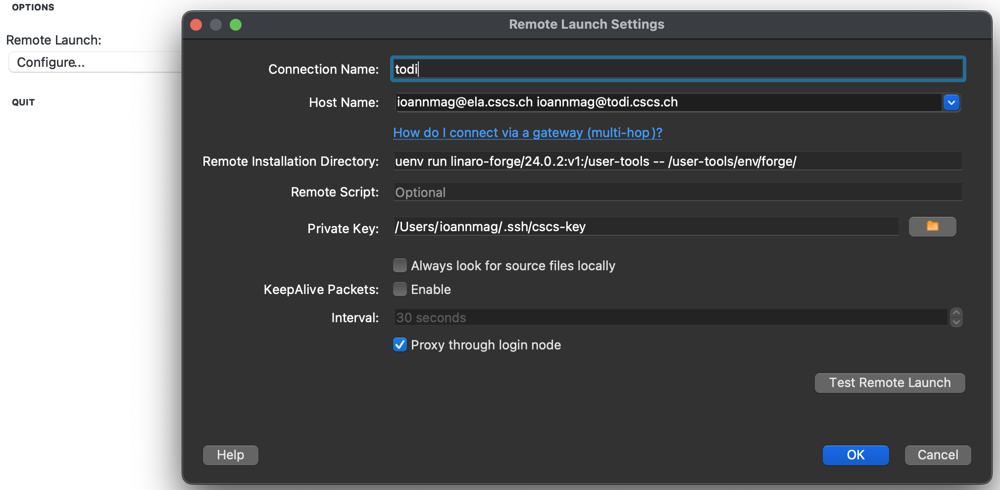
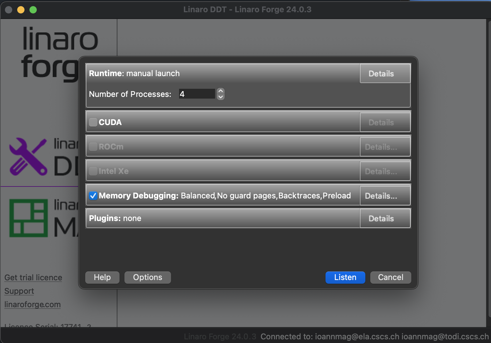
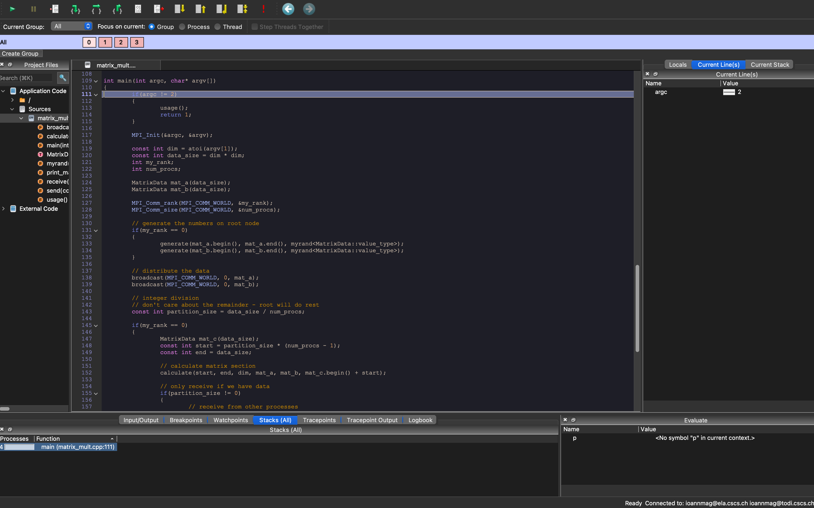
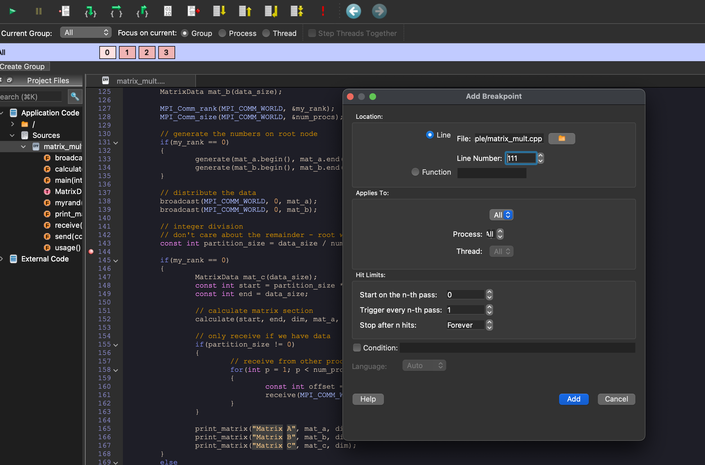
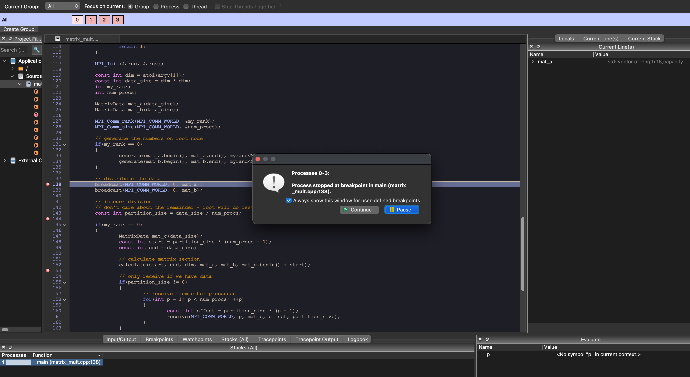
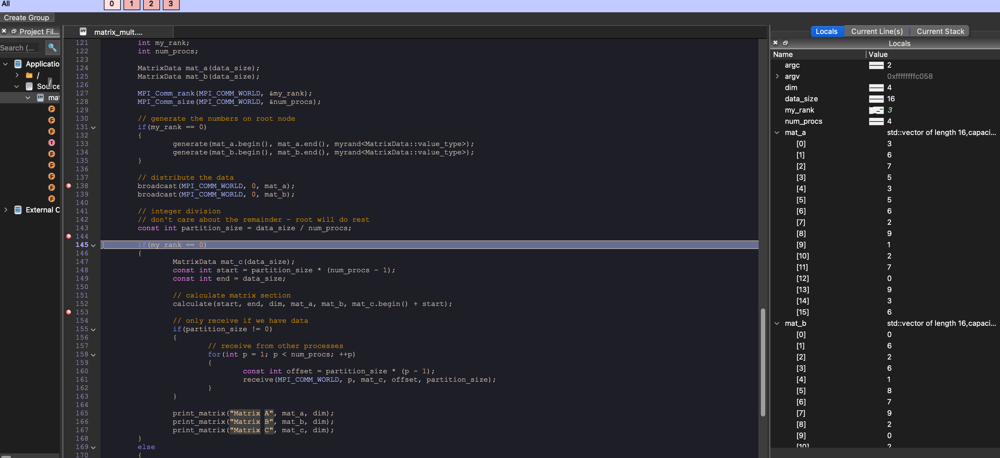
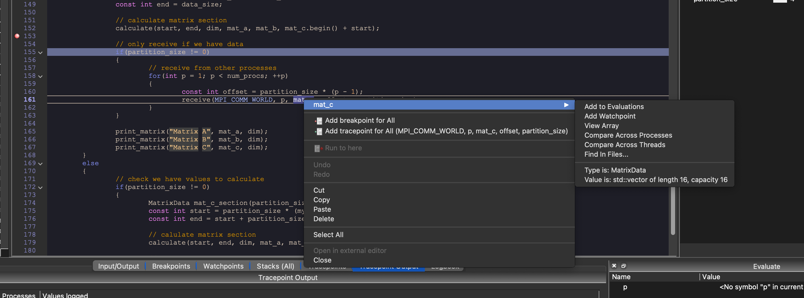
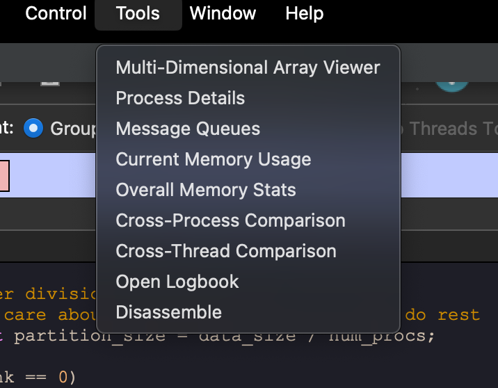
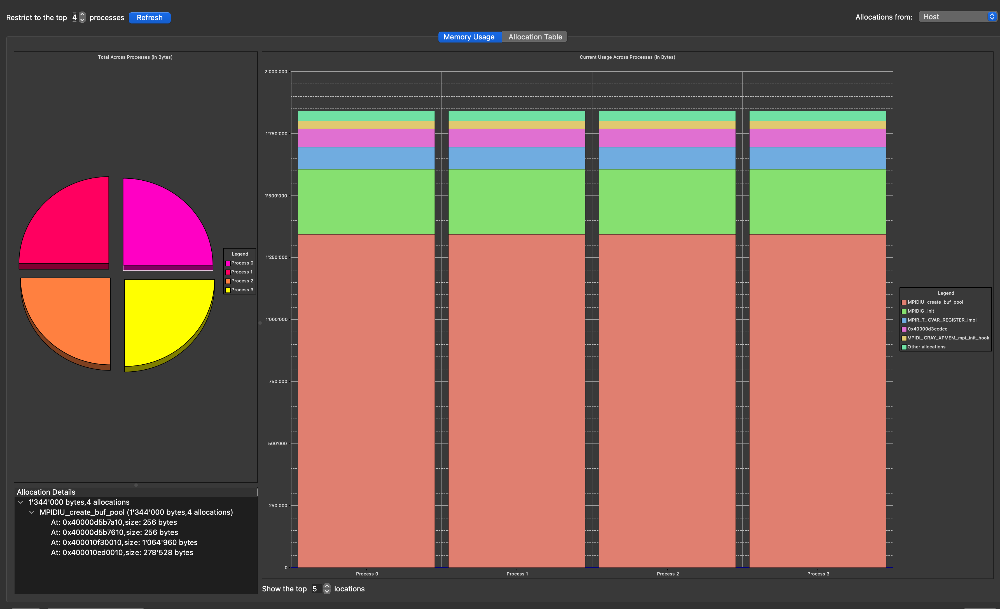
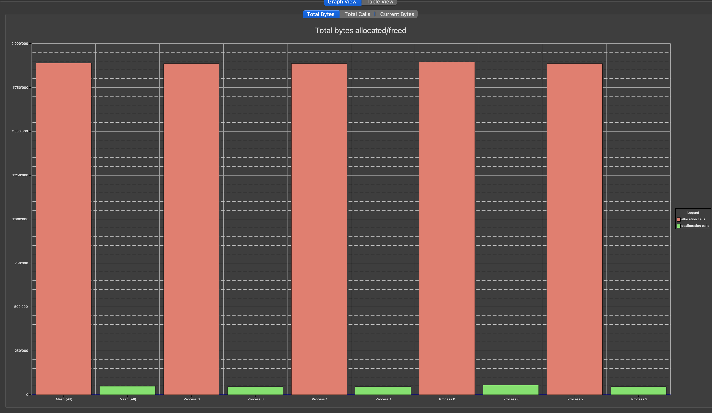

# Advanced C++ Course

<!-- _paginate: skip  -->
<!-- _class: titlecover -->
<!-- _footer: "" -->

### Linaro Forge
#### CSCS

--- 

# Introduction

## Linaro Forge tools

- MAP
  - "Linaro MAP is a high-performance profiler designed to optimize the efficiency of software running on multicore processors."
  - Sampling profiler
  - Designed for 'hot-spot' analysis with stack traces and performance metrics
  - Supports C/C++/Fortran/Python
  - AMD & Nvidia GPU profiling
  - Performance Reports
- DDT
  - "Linaro DDT is an advanced debugger designed to simplify the troubleshooting and optimization of complex, high-performance computing (HPC) applications."
  - Supports C/C++/Fortran/Python
  - AMD & Nvidia GPUs

---

# Forge client configuration

- Forge client on local machine (Linux, MacOS)
- License
  - Max processes 272 / Max users 256

## `TODI` remote setup




---

# MAP

## Instructions

### Todi

```bash
uenv start --view=linaro:forge,prgenv-gnu:default prgenv-gnu/24.7 linaro-forge/24.0.2
map -n 4 --mpi=slurm --mpiargs="-A csstaff -p debug -t 10" --profile ./matrix_mult 4
```

### Local machine

- Connect to `todi`
- `LOAD PROFILE DATA FILE`

---

# DDT

## Instructions

### Local machine

- Connect to `todi`
- `MANUAL LAUNCH (ADVANCED)`
- Create correct listener

### Todi

```bash
uenv start --view=linaro:forge,prgenv-gnu:default prgenv-gnu/24.7 linaro-forge/24.0.2
srun -n 4 -A csstaff -t30 -p debug ddt-client ./matrix_mult 4
```

---

# Demo

<!-- - Linaro MAP
  - How to run it / load it with uenv
  - How to open file locally
  - Mention x86_64 and ARM counters and differences
  - Take pictures and create backup slides
- Linaro DDT
  - How to run / load it with uenv
  - Mention how many processes/threads license we have
  - Show backward connection and configuration
  - Find some meaningful MPI application (?)
  - Show what user can use
  - Check GPU debugging support
  - How add source code
  - Take pictures and create backup slides
  - Mention supported platforms -->

---

# Questions?

<!-- _paginate: skip  -->
<!-- _class: titlecover -->
<!-- _footer: "" -->

---

# Resources

- [Linaro MAP website](https://www.linaroforge.com/linaro-map/)
- [Linaro DDT website](https://www.linaroforge.com/linaro-ddt)
- [Ensuring Program Correctness with Linaro DDT_ Rudy Shand](https://www.youtube.com/watch?v=z26nWyvmEXM)

---

# Backup slides

---

# DDT


---



---



---



---



---



---



---


---


---



---



---



---

# MAP