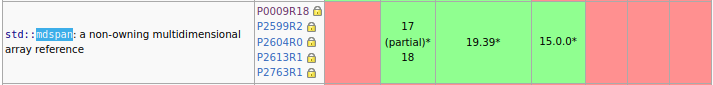
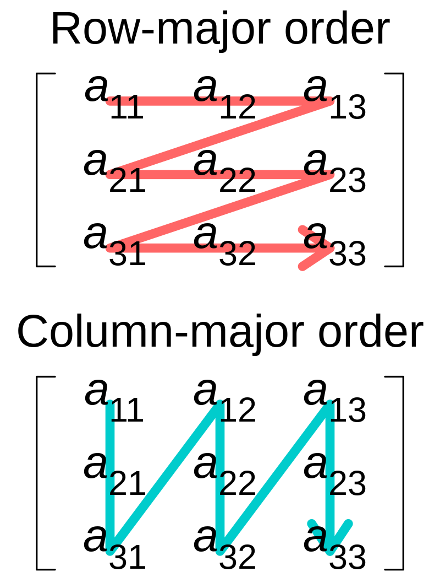

# Advanced C++ Course

<!-- _paginate: skip  -->
<!-- _class: titlecover -->
<!-- _footer: "" -->

### std::mdspan

#### CSCS

--- 

# Motivation

- How can we deal with multi-dimensional data with different layout: C-Layout vs Fortran-Layout

Every HPC software dealing with multi-dimensional data implements their own:
- allocation of multi-dimensional data (host/device, alignment, layout)
- accessing multi-dimensional data (abstract layout)
- iteration/algorithms over multi-dimensional data (in HPC mostly domain specific, highly optimized)

How to interface between libraries?
- Best case: well-defined/described concept that can be modelled by the *other* library
- Worst case: concrete class


**`std::mdspan` is**
- **a non-owning multi-dimensional array view**
- **meant to be used in interfaces**

---

# What is std::mdspan?

`std::mdspan ` is a non-owning multi-dimensional array view

- since C++23, see https://wg21.link/p0009 \* and https://eel.is/c++draft/views#multidim

- think of *pointer* and *metadata* (how to interpret the pointed-to memory)

```c++
template<
    class T,
    class Extents,
    class LayoutPolicy = std::layout_right,
    class AccessorPolicy = std::default_accessor<T>
> class mdspan;
```

- *TriviallyCopyable*\**: can be used in host/device interfaces
- allows different layouts

\* and various additions
\** under some constraints

---

# std::mdspan<...>

```c++
template<
    class T,
    class Extents,
    class LayoutPolicy = std::layout_right,
    class AccessorPolicy = std::default_accessor<T>
> class mdspan;
```
```c++
std::vector<float> v(100);
auto my_mdspan = std::mdspan(v.data(), std::extents{ 10, 10 });
```

- `T` is the element type (`my_mdspan::element_type`): `float`
- `Extents` describes number of dimensions and their sizes (required to be specialization of `std::extents`)
- `LayoutPolicy` describes memory layout (`my_mdspan::layout_type`): default `std::layout_right` (C-layout)
- `AccessorPolicy` allows customization how we access the data (`my_mdspan::accessor_type`):
  think `std::default_accessor<T>` does pointer dereference of `T*`

```c++
my_mdspan[2, 3] = 42.;
```
---

# std::extents

- can describe run-time and compile-time extents
- compile-time extents are helpful for optimizations (explicit by library implementor or implicit by compiler)

```c++
template< class IndexType, std::size_t... Extents >
class extents;
```

- `IndexType` is a signed or unsigned integer type
- each element of `Extents` is either
  - `std::dynamic_extent` or 
  - number representable in `IndexType` (compile-time extents)

---

# std::extents

## Examples

```c++
auto ext1 = std::extents<int, std::dynamic_extent, 3, std::dynamic_extent, 4>{ 42, 43 };
static_assert(decltype(ext1)::rank() == ?);
static_assert(decltype(ext1)::rank_dynamic() == ?);
static_assert(decltype(ext1)::static_extent(0) == ?);
assert(ext1.extent(0) == ?);
static_assert(decltype(ext1)::static_extent(1) == ?);
```

```c++
auto ext2 = std::extents<std::uint8_t, 3, 4>{};
static_assert(decltype(ext2)::static_extent(0) == ?);
static_assert(decltype(ext2)::static_extent(1) == ?);
```

```c++
auto ext3 = std::extents{42, 44};
static_assert(decltype(ext3)::static_extent(0) == ?);
assert(ext3.extent(0) == ?);
```

```c++
auto ext4 = std::dextents<int, 3>{ 42, 43, 44 };
```

---

# std::extents

## Examples

```c++
auto ext1 = std::extents<int, std::dynamic_extent, 3, std::dynamic_extent, 4>{ 42, 43 };
static_assert(decltype(ext1)::rank() == 4);
static_assert(decltype(ext1)::rank_dynamic() == 2);
static_assert(decltype(ext1)::static_extent(0) == std::dynamic_extent);
assert(ext1.extent(0) == 42);
static_assert(decltype(ext1)::static_extent(1) == 3);
```

```c++
auto ext2 = std::extents<std::uint8_t, 3, 4>{};
static_assert(decltype(ext2)::static_extent(0) == 3);
static_assert(decltype(ext2)::static_extent(1) == 4);
```

```c++
auto ext3 = std::extents{42, 44};
static_assert(decltype(ext3)::static_extent(0) == std::dynamic_extent);
assert(ext3.extent(0) == 42);
```

```c++
auto ext4 = std::dextents<int, 3>{ 42, 43, 44 };
```

---

# LayoutPolicy

<div class="twocolumns">
<div>

- provided policies:
  - `std::layout_right` (default, row-major, C-layout)
  - `std::layout_left` (column-major, Fortran-layout)
  - `std::layout_stride` generalization for arbitrary strides
- custom layout:
  - skip elements (e.g. tiling)
  - multiple indices to the same element
</div>
<div>


https://commons.wikimedia.org/wiki/User:Cmglee, CC BY-SA 4.0
</div>
</div>


```c++
auto s = std::mdspan(some_ptr, std::layout_stride::mapping(std::extents(2, 5, 10), std::array{ 5, 1, 10 }));

assert((some_ptr[1*5 + 2*1 + 3*10] == s[1, 2, 3]));
```


---

# Layout example: matrix vector multiply*

```c++
using layout = /* see-below */;

std::mdspan<double, std::extents<int, N, M>, layout> A = ...;
std::mdspan<double, std::extents<int, N>> y = ...;
std::mdspan<double, std::extents<int, M>> x = ...;

std::ranges::iota_view range{0, N};

std::for_each(std::execution::par_unseq, 
  std::ranges::begin(range), std::ranges::end(range),
  [=](int i) {
     double sum = 0.0;
     for(int j = 0; j < M; ++j) {
       sum += A[i, j] * x[j];
     }
     y[i] = sum;
  });
```

- on CPUs: C-layout aka row-major aka std::layout_right performs well (vectorized inner loop)
- on GPUs: Fortran-layout aka column-major aka std::layout_left performs well (coalesced memory load)

\* from https://www.open-std.org/jtc1/sc22/wg21/docs/papers/2022/p0009r18.html 2.6

---

# Outlook: Example LayoutPolicy std::linalg::transposed

(illustrative example, not standard conforming)

```c++
template <class Layout> struct transposed_layout {
  template <class Extents>
  struct mapping : public Layout::template mapping<impl::transposed_extents_t<Extents>> {
    using _base_mapping = typename Layout::template mapping<impl::transposed_extents_t<Extents>>;
    using extents_type = Extents;

    template <class I0, class I1>
    constexpr _base_mapping::index_type operator()(I0 i0, I1 i1) const noexcept{
      return _base_mapping::operator()(i1, i0);
    }

    constexpr extents_type extents() const noexcept { // std requires const& return
      return impl::transpose_extents(_base_mapping::extents());
    }
  };
};

template <class T, class E, class L, class A, class TE = /*...*/, class TL = transposed_layout<L>>
auto transposed(std::mdspan<T, E, L, A> m) {
  return std::mdspan<T, TE, TL, A>{
      m.data_handle(), {m.mapping()}, m.accessor()};
}
```

---

# AccessorPolicy

- customization of how to access the data: e.g. `restrict`, atomic access, ...

## Example

```c++
template <class ElementType>
struct default_accessor {
  using offset_policy = default_accessor;
  using element_type = ElementType;
  using reference = ElementType&;
  using data_handle_type = ElementType*;

  // some ctors

  constexpr data_handle_type offset(data_handle_type p, size_t i) const noexcept {
    return p + i;
  }

  constexpr reference access(data_handle_type p, size_t i) const noexcept {
    return p[i];
  }
};
```

---
# Custom Accessor Example: protect host/device access

```c++
template <class ElementType, DeviceType Device>
struct host_device_protector {
    using offset_policy = host_device_protector; using element_type = ElementType;
    using reference = ElementType&; using data_handle_type = ElementType*;

    constexpr data_handle_type offset(data_handle_type p, size_t i) const noexcept { return p + i; }

    constexpr reference access(data_handle_type p, size_t i) const noexcept {
#ifdef __CUDA_ARCH__
        static_assert(Device == DeviceType::CUDA);
#else
        static_assert(Device == DeviceType::CPU);
#endif
        return p[i];
    }
};
```
```c++
void test_host_device_protector() {
    float* dev_ptr = allocate_some_cuda_memory<float>(4);
    auto s = std::mdspan<float, std::dextents<int, 2>, std::layout_right, host_device_protector<float, DeviceType::CPU>>{ dev_ptr, std::dextents<int, 2>{ 2, 2 } };
    std::cout << s[1, 2] << std::endl;
}
```

```bash
> error: static assertion failed due to requirement '(DeviceType)1 == DeviceType::CPU'
```

---

# Outlook: Example std::linalg::scaled

```c++
template <class WrappedAccessor, class ScaleType> struct scaled_accessor {
  ScaleType factor;
  WrappedAccessor a;
  using element_type = std::add_const_t<
      decltype(std::declval<typename WrappedAccessor::element_type>() *
               factor)>;
  using data_handle_type = WrappedAccessor::data_handle_type;
  using reference = std::remove_const_t<element_type>;
  using offset_policy = WrappedAccessor::offset_policy;

  constexpr data_handle_type offset(data_handle_type p,
                                    size_t i) const noexcept {
    return p + i;
  }
  constexpr reference access(data_handle_type p, size_t i) const noexcept {
    return p[i] * factor;
  }
};

template <class T, class E, class L, class A, class U,
          class SA = scaled_accessor<A, U>>
auto scaled(U factor, std::mdspan<T, E, L, A> m) {
  return std::mdspan<typename SA::element_type, E, L, SA>{
      m.data_handle(), m.mapping(), SA{factor, m.accessor()}};
}
```

---

# Accessing data in mdspan

```c++
my_mdspan[1,2,3];
```
has the *effect* of
```c++
template<class... OtherSizeTypes>
constexpr reference operator[](OtherSizeTypes... indices) {
    return acc_.access(ptr_,map_(static_cast<size_type>(std::move(indices))...));
}
```

---

# 18 revisions, several extensions and not done

- since the first proposal in 2015, C++ changed, e.g. CTAD

In P0009:
```c++
mdspan<double, dynamic_extent, dynamic_extent> a(data, 64, 64);
void f(std::mdspan<float, std::extents<std::dynamic_extent, std::dynamic_extent, std::dynamic_extent>> a);
```
with P2299:
```c++
mdspan a(data, 64, 64);
void f(std::mdspan<float, std::dextents<3>> a);
```
but P2553:
```c++
void f(mdspan<float, std::dextents<std::size_t, 3>> a);
```
so P2389 (C++26):
```c++
void f(mdspan<float, std::dims<3>> a);
```


---

# std::submdspan() - C++26 (P2630)

```c++
template<class T, class E, class L, class A,
         class ... SliceArgs>
auto submdspan(mdspan<T,E,L,A> x, SliceArgs ... args);
```

### A *slice specifier* can be
- an integral value
- something convertible to `tuple<mdspan::index_type, mdspan::index_type>` denoting begin to end range (Python: `start:stop`)
- instance of `full_extent_t` (Python: `:`)
- an instance of
  ```c++
  template<class OffsetType, class ExtentType, class StrideType>
  struct strided_slice {
    // ...
    [[no_unique_address]] OffsetType offset{};
    [[no_unique_address]] ExtentType extent{};
    [[no_unique_address]] StrideType stride{};
  };
  ```
  Note: Unlike Python, Fortran (...) doesn't use `stop` but `extent`.

---

# std::submdspan

## Examples

```c++
// m = std::mdspan(..., std::extents<int, std::dynamic_extent, 10>{8}) with m[i, j] == i * 10 + j
auto s1 = std::submdspan(m, std::tuple(1, 3), std::full_extent);
assert(s1.extent(0) == ?);
assert((s1[0, 0] == ?));
assert((s1[1, 1] == ?));
```

```c++
auto s2 = std::submdspan(m, std::tuple(1, 3), 5);
assert(s2[0] == ?);
assert(s2[1] == ?);
```

```c++
auto s3 = std::submdspan(m, 4, 2);
static_assert(decltype(s3)::rank() == ?);
assert(s3[] == ?);
```

```c++
auto s4 = std::submdspan(m, std::tuple(std::integral_constant<int, 1>{}, std::integral_constant<int, 3>{}), std::tuple(3, 5));
static_assert(decltype(s4)::rank() == ?);
static_assert(decltype(s4)::static_extent(0) == ?);
assert((s4[0, 0] == ?));
assert((s4[1, 1] == ?));
```

---

# std::submdspan

## Examples

```c++
// m = std::mdspan(..., std::extents<int, std::dynamic_extent, 10>{8}) with m[i, j] == i * 10 + j
auto s1 = std::submdspan(m, std::tuple(1, 3), std::full_extent);
assert(s1.extent(0) == 2);
assert((s1[0, 0] == 10));
assert((s1[1, 1] == 21));
```

```c++
auto s2 = std::submdspan(m, std::tuple(1, 3), 5);
assert(s2[0] == 15);
assert(s2[1] == 25);
```

```c++
auto s3 = std::submdspan(m, 4, 2);
static_assert(decltype(s3)::rank() == 0);
assert(s3[] == 42);
```

```c++
auto s4 = std::submdspan(m, std::tuple(std::integral_constant<int, 1>{}, std::integral_constant<int, 3>{}), std::tuple(3, 5));
static_assert(decltype(s4)::rank() == 2);
static_assert(decltype(s4)::static_extent(0) == 2);
assert((s4[0, 0] == 13));
assert((s4[1, 1] == 24));
```

---
# std::submdspan

## Examples


```c++
auto s5 = std::submdspan(
      m, 0, std::strided_slice{.offset = 2, .extent = 4, .stride = 2});
static_assert(decltype(s5)::rank() == ?);
static_assert(decltype(s5)::static_extent(0) == ?);
assert(s5.extent(0) == ?);
```


```c++
auto s6 = std::submdspan(
    m, 0,
    std::strided_slice{.offset = 2,
                        .extent = std::integral_constant<int, 4>{},
                        .stride = std::integral_constant<int, 1>{}});
static_assert(decltype(s6)::rank() == ?);
static_assert(decltype(s6)::static_extent(0) == ?);
```

---
# std::submdspan

## Examples


```c++
auto s5 = std::submdspan(
      m, 0, std::strided_slice{.offset = 2, .extent = 4, .stride = 2});
static_assert(decltype(s5)::rank() == 1);
static_assert(decltype(s5)::static_extent(0) == std::dynamic_extent);
assert(s5.extent(0) == 2);
```


```c++
auto s6 = std::submdspan(
    m, 0,
    std::strided_slice{.offset = 2,
                        .extent = std::integral_constant<int, 4>{},
                        .stride = std::integral_constant<int, 1>{}});
static_assert(decltype(s6)::rank() == 1);
static_assert(decltype(s6)::static_extent(0) == 4);
```

---
# std::submdspan Implementation

```c++
template<class T, class E, class L, class A,
         class ... SliceArgs>
auto submdspan(const mdspan<T,E,L,A>& src, SliceArgs ... args) {
  auto sub_map_offset = submdspan_mapping(src.mapping(), args...);
  return mdspan(src.accessor().offset(src.data(), sub_map_offset.offset),
                sub_map_offset.mapping,
                AccessorPolicy::offset_policy(src.accessor()));
}
```

## Customization point

```c++
template<class Mapping, class ... SliceArgs>
auto submdspan_mapping(const Mapping&, SliceArgs...) { /* ... */ }
```

- For custom layouts users can provide their own `submdspan_mapping`, which will be found via ADL.
- There is no default implementation.

<!--

---

# Example: mdspan from custom mdarray\*


```c++
template <class T, std::size_t N>
struct my_mdarray {
    std::vector<T> data_;
    std::array<int, N> sizes_;

    my_mdarray(std::convertible_to<int> auto... sizes) : data_((sizes * ...)), sizes_{ sizes... } {
    }

    std::mdspan<T, std::dextents<int, N>> to_mdspan() {
        return { data_.data(), std::dextents<int, N>{ sizes_ } };
    }

    operator std::mdspan<T, std::dextents<int, N>>() {
        return { data_.data(), std::dextents<int, N>{ sizes_ } };
    }
};
```


\* std::mdarray is proposed in https://wg21.link/p1684
-->

<!--

---

# Extensions to P0009

(TODO maybe move into other slides)

## P2642 - Padded mdspan layouts (in C++26)
## P2553 - Make mdspan size_type controllable (in C++23)
## P3029 - Better mdspan's CTAD (in C++26)
## P2630 - std::submdspan() (in C++26)

-->

---

# std::mdarray (P1684) for C++26

> One major goal of the design for `mdarray` is to parallel the design of `mdspan` as much as possible, with the goals of reducing cognitive load for users already familiar with `mdspan` and of incorporating the lessons learned from over a decade of experience with P0009 [...]. (P1684)

```c++
mdarray<double, dextents<int, 2>> matrix(N,M);
```

```c++
template<class ElementType,
         class Extents,
         class LayoutPolicy = layout_right,
         class Container = vector<ElementType>>
  class mdarray;
```

Main difference: owning vs reference semantics and additional overloads.

---

# std::mdarray

## Examples

```c++
std::vector<double> v(42);
std::experimental::mdarray<double, std::dextents<int, 2>> b{std::dextents<int, 2>{2, 21}, v};
```

```c++
std::experimental::mdarray<double, std::dextents<int, 2>> c{std::dextents<int, 2>{2, 21}, std::move(v)};
```

```c++
std::experimental::mdarray<int, std::dextents<int, 2>, std::layout_right,std::vector<int, FancyAllocator<int>>>
      d{std::dextents<int, 2>{2, 21}, FancyAllocator<int>{}};
```

and ~20 more overloads.

## Recent discussion

**`mdarray` design questions and answers** (2024-05-21, http://wg21.link/p3308)

---

# Status of multi-dimensional C++

✅ accessing multi-dimensional data (mdspan)
🔶 allocating multi-dimensional data (mdarray)
❌ iterating multi-dimensional data / multi-dimensional algorithms (see e.g. \*)


\* [Multidimensional C++, Bryce A. Lelbach at CppNorth 2022](https://youtu.be/aFCLmQEkPUw?si=4LI8eo5ZvBLEjDxq) 

---

# Questions?

<!-- _paginate: skip  -->
<!-- _class: titlecover -->
<!-- _footer: "" -->

---

# Quiz

- For a layout policy which is not `std::layout_right` or `std::layout_left`, can we optimize stride-1 access? Under which constraints?
- Is a wrap-around semantics for a custom accessor possibly? E.g.
  ```c++
  std::vector<int> data{0, 1, 2, 3, 4};
  auto s = std::mdspan<...>(data.data(), ...);
  assert(s[5] == 0);
  assert(s[6] == 1);
  ```
