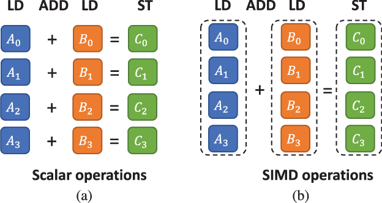
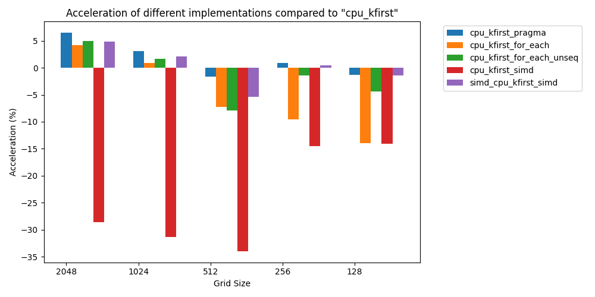

# Advanced C++ Course

<!-- _paginate: skip  -->
<!-- _class: titlecover -->
<!-- _footer: "" -->

### std::simd

#### CSCS

--- 

# Introduction

## Introduction of `std::simd` is targeted at C++26

### What is `std::simd`?

- Data-parallel type of C++
- Encapsulates vectorization in C++
- Provide interface and portability

### Related proposals

- [P1928R11: std::simd — merge data -parallel types from the Parallelism TS 2](https://www.open-std.org/jtc1/sc22/wg21/docs/papers/2024/p1928r11.pdf)
- [P2876R1: Proposal to extend std::simd with more constructors and accessors](https://www.open-std.org/jtc1/sc22/wg21/docs/papers/2024/p2876r1.html)
- [P2664R7: Extend std::simd with permutation API](https://www.open-std.org/jtc1/sc22/wg21/docs/papers/2024/p2664r7.html)
- [P2964R1: Adding support for user-defined element types (UDT) in std::simd](https://www.open-std.org/jtc1/sc22/wg21/docs/papers/2024/p2964r1.html)

---

# What is vectorization?

<div class="twocolumns">
<div>

## Single Instruction Multiple Data

- One instruction performs the same operation on multiple data points simultaneously
- Hardware support is necessary
- Different instruction sets supported by different CPUs (SSE, SSE2, SSE3, AVX, AVX2, AVX512, NEON, SVE, ...)
- Various vector lengths depending on CPU and ISA
</div>
<div>

</div>
</div>

## GH200 SIMD

- 72x Arm Neoverse V2 cores
- 4×128-bit SIMD units per core

---

# Vectorization in C++

- Compiler auto vectorization (`-O2`, `-O3`, `-ftree-vectorize`, etc)
- Compiler pragmas in loops (`#pragma omp simd`, `#pragma GCC ivdep`, `#pragma ivdep`, `#pragma clang loop vectorize(assume_safety) interleave(enable)`)
  - Compiler specific
  - Don't ensure vectorization
  - Too verbose
- [VCL C++ vector class library (Agner Fog)](https://www.agner.org/optimize/vcl_manual.pdf)
- [eve](https://github.com/jfalcou/eve)
- [xsimd](https://github.com/xtensor-stack/xsimd)
- [Vc](https://github.com/VcDevel/Vc)
- [highway](https://github.com/google/highway)
- [Kokkos](https://kokkos.org/kokkos-core-wiki/API/simd/simd.html)
  - Based on std::simd C++ proposal
- [std::execution::unsequenced_policy](https://en.cppreference.com/w/cpp/algorithm/execution_policy_tag_t)
  - [std::execution::simd proposal](https://www.open-std.org/jtc1/sc22/wg21/docs/papers/2020/p0350r4.pdf)

---

# std::experimental::simd

```c++
// Defined in header <experimental/simd>
template< class T, class Abi = simd_abi::compatible<T> >
class simd;
```

- `T` is the vector elements' type
- `std::simd` is a data-parallel type that operates on multiple elements of type T at the same time

```c++
// User defined length N
template< class T, int N >
using fixed_size_simd = std::experimental::simd<T, std::experimental::simd_abi::fixed_size<N>>;
// most efficient for given architecture
template< class T >
using native_simd = std::experimental::simd<T, std::experimental::simd_abi::native<T>>;
```

---

# Example

```c++
#include <experimental/simd>
#include <numeric>
namespace stdx = std::experimental;
 
int main()
{
    const auto native_simd_length{stdx::native_simd<int>::size()};    // vector length
    alignas(stdx::memory_alignment_v<stdx::native_simd<int>>)
        std::array<int, native_simd_length * 2> a{};                  // instantiate aligned array
    std::iota(a.begin(), a.end(), 0);                                 // initialize it: 0 1 2 3 4 5 6 7 
    std::array<int, native_simd_length * 2> c;                        // define output array
    for (std::size_t i{}; i < a.size(); i += native_simd_length) {
        stdx::native_simd<int> x;
        stdx::native_simd<int> y{[](int k){ return k; }};             // 0 1 2 3
        x.copy_from(&a[i], stdx::vector_aligned);
        const auto z = x + y;
        z.copy_to(&c[i], stdx::element_aligned);
    }
    // c: 0 2 4 6 4 6 8 10 
}
```

<!-- ```c++
#include <cstddef>
#include <experimental/simd>
#include <format>
#include <iostream>
#include <numeric>
namespace stdx = std::experimental;
 
void print(auto const& a)
{
    for (std::size_t i{}; i != std::size(a); ++i)
        std::cout << a[i] << ' ';
    std::cout << '\n';
}
 
int main()
{
    const auto native_simd_length{stdx::native_simd<int>::size()};
    alignas(stdx::memory_alignment_v<stdx::native_simd<int>>)
        std::array<int, native_simd_length * 2> a{};
    std::iota(a.begin(), a.end(), 0);
    print(a);

    std::array<int, native_simd_length * 2> c;
 
    for (std::size_t i{}; i < a.size(); i += native_simd_length) {
        std::cout << std::format("[i: {}] y: ", i);
        stdx::native_simd<int> x;
        stdx::native_simd<int> y{[](int k){ return k; }};
        print(y);
        x.copy_from(&a[i], stdx::vector_aligned);
        const auto z = x + y;
        z.copy_to(&c[i], stdx::element_aligned);
    }
    print(c);
}
// 0 1 2 3 4 5 6 7 
// [i: 0] y: 0 1 2 3 
// [i: 4] y: 0 1 2 3 
// 0 2 4 6 4 6 8 10 
``` -->
---

# std::simd_mask, std::where_expression, std::reduce

```c++
template<class A>
stdx::simd<int, A> simd_select_l(stdx::simd_mask<int, A> where_mask, stdx::simd<int, A> x, stdx::simd<int, A> y)
{
    where(where_mask, x) = y;
    return x;
}

stdx::native_simd<int> f(stdx::native_simd<int> x /*1 3 5 7*/, stdx::native_simd<int> y /*0 2 4 6*/) {
  x = simd_select_l(x < y, y, x);                      // 0 2 4 6
  if (all_of(x <= y)) {
    std::cout << "simd_select_l works!\n";             // simd_select_l works!
  }
  std::cout << "min_value: " << stdx::hmin(x) << "\n"; // min_value: 0
  std::cout << "sum: " << stdx::reduce(x) << "\n";     // sum: 12
  return x;
}

void print_cos_sin(stdx::native_simd<double> x) {
    std::cout << "cos²(x) + sin²(x) = ";
    print(stdx::pow(stdx::cos(x), 2) + stdx::pow(stdx::sin(x), 2));  // 1 1 1 1
}
```

---

# Other features

- permute & scatter/gather [[P2664R7]](https://www.open-std.org/jtc1/sc22/wg21/docs/papers/2024/p2664r7.html)
- Math functions
  - Previously pain point because it was necessary to have a library with math functions with signatures (libmvec, sleef, svml, etc)
- Constructors with std::continuous_range/std::span [[P2876R1]](https://www.open-std.org/jtc1/sc22/wg21/docs/papers/2024/p2876r1.html)

---
# Performance evaluation

## Nabla4 kernel (ICON)

```c++
void run_cpu_kfirst() {
    for (std::size_t edge_index{}; edge_index < e2c2v.size(); ++edge_index) {
        const auto E2C2V_0 = e2c2v[edge_index][0];
        ...
        const auto E2ECV_0 = e2ecv[edge_index][0];
        ...
        const std::array<WP_TYPE, 4> primal_normal_vert_v1_e2ecv = {primal_normal_vert_v1[E2ECV_0], ...};
        const std::array<WP_TYPE, 4> primal_normal_vert_v2_e2ecv = {primal_normal_vert_v2[E2ECV_0], ...};
        const auto inv_vert_vert_length_sqr = inv_vert_vert_length[edge_index] * inv_vert_vert_length[edge_index];
        const auto inv_primal_edge_length_sqr = inv_primal_edge_length[edge_index] * inv_primal_edge_length[edge_index];
        for (std::size_t k_index = 0; k_index < KDim; ++k_index) {
            double nabv_tang_wp = u_vert[E2C2V_0][k_index] * primal_normal_vert_v1_e2ecv[0] +
                                  v_vert[E2C2V_0][k_index] * primal_normal_vert_v2_e2ecv[0] +
                                  u_vert[E2C2V_1][k_index] * primal_normal_vert_v1_e2ecv[1] +
                                  v_vert[E2C2V_1][k_index] * primal_normal_vert_v2_e2ecv[1];
            double nabv_norm_wp = u_vert[E2C2V_2][k_index] * primal_normal_vert_v1_e2ecv[2] +
                                  v_vert[E2C2V_2][k_index] * primal_normal_vert_v2_e2ecv[2] +
                                  u_vert[E2C2V_3][k_index] * primal_normal_vert_v1_e2ecv[3] +
                                  v_vert[E2C2V_3][k_index] * primal_normal_vert_v2_e2ecv[3];
            z_nabla4_e2_wp[edge_index][k_index] =
                4.0 * ((nabv_norm_wp - 2.0 * z_nabla2_e[edge_index][k_index]) * inv_vert_vert_length_sqr +
                          (nabv_tang_wp - 2.0 * z_nabla2_e[edge_index][k_index]) * inv_primal_edge_length_sqr);
        };
    };
};
```

---

```c++
void run_cpu_kfirst_pragma() {
    for (std::size_t edge_index{}; edge_index < e2c2v.size(); ++edge_index) {
      ...
#ifdef __clang__
#pragma clang loop unroll_count(8) vectorize(assume_safety) interleave(enable)
#elif defined(__GNUC__)
#pragma GCC ivdep
#endif
        for (std::size_t k_index = 0; k_index < KDim; ++k_index) {
            double nabv_tang_wp = u_vert[E2C2V_0][k_index] * primal_normal_vert_v1_e2ecv[0] +
                                  v_vert[E2C2V_0][k_index] * primal_normal_vert_v2_e2ecv[0] +
                                  u_vert[E2C2V_1][k_index] * primal_normal_vert_v1_e2ecv[1] +
                                  v_vert[E2C2V_1][k_index] * primal_normal_vert_v2_e2ecv[1];
            double nabv_norm_wp = u_vert[E2C2V_2][k_index] * primal_normal_vert_v1_e2ecv[2] +
                                  v_vert[E2C2V_2][k_index] * primal_normal_vert_v2_e2ecv[2] +
                                  u_vert[E2C2V_3][k_index] * primal_normal_vert_v1_e2ecv[3] +
                                  v_vert[E2C2V_3][k_index] * primal_normal_vert_v2_e2ecv[3];
            z_nabla4_e2_wp[edge_index][k_index] =
                4.0 * ((nabv_norm_wp - 2.0 * z_nabla2_e[edge_index][k_index]) * inv_vert_vert_length_sqr +
                          (nabv_tang_wp - 2.0 * z_nabla2_e[edge_index][k_index]) * inv_primal_edge_length_sqr);
        };
    };
};
```
---

```c++
void run_cpu_kfirst_for_each() {
    for (std::size_t edge_index{}; edge_index < e2c2v.size(); ++edge_index) {
        ...
        auto kernel_fields = std::views::zip(u_vert[E2C2V_0],
            u_vert[E2C2V_1],
            u_vert[E2C2V_2],
            u_vert[E2C2V_3],
            v_vert[E2C2V_0],
            v_vert[E2C2V_1],
            v_vert[E2C2V_2],
            v_vert[E2C2V_3],
            z_nabla2_e[edge_index]);
        const auto kernel_input_fields = std::views::enumerate(kernel_fields);
        std::for_each(kernel_input_fields.begin(), kernel_input_fields.end(), [&](const auto &pair) {
            const auto k_index = get<0>(pair);
            const auto kernel_fields = get<1>(pair);
            const auto u_vert_e2c2v_0 = get<0>(kernel_fields);
            ...
            const auto v_vert_e2c2v_0 = get<4>(kernel_fields);
            ...
            double nabv_tang_wp =
                u_vert_e2c2v_0 * primal_normal_vert_v1_e2ecv[0] + v_vert_e2c2v_0 * primal_normal_vert_v2_e2ecv[0] +
                u_vert_e2c2v_1 * primal_normal_vert_v1_e2ecv[1] + v_vert_e2c2v_1 * primal_normal_vert_v2_e2ecv[1];
            double nabv_norm_wp =
                u_vert_e2c2v_2 * primal_normal_vert_v1_e2ecv[2] + v_vert_e2c2v_2 * primal_normal_vert_v2_e2ecv[2] +
                u_vert_e2c2v_3 * primal_normal_vert_v1_e2ecv[3] + v_vert_e2c2v_3 * primal_normal_vert_v2_e2ecv[4];
            const auto z_nabla2_e_edge_index = get<8>(kernel_fields);
            z_nabla4_e2_wp[edge_index][k_index] =
                4.0 * ((nabv_norm_wp - 2.0 * z_nabla2_e_edge_index) * inv_vert_vert_length_sqr +
                          (nabv_tang_wp - 2.0 * z_nabla2_e_edge_index) * inv_primal_edge_length_sqr);
        });
    };
};
```
---

```c++
void run_cpu_kfirst_for_each_unseq() {
    for (std::size_t edge_index{}; edge_index < e2c2v.size(); ++edge_index) {
        ...
        auto kernel_fields = std::views::zip(u_vert[E2C2V_0],
            u_vert[E2C2V_1],
            u_vert[E2C2V_2],
            u_vert[E2C2V_3],
            v_vert[E2C2V_0],
            v_vert[E2C2V_1],
            v_vert[E2C2V_2],
            v_vert[E2C2V_3],
            z_nabla2_e[edge_index]);
        const auto kernel_input_fields = std::views::enumerate(kernel_fields);
        std::for_each(std::execution::unseq, kernel_input_fields.begin(), kernel_input_fields.end(), [&](const auto &pair) {
            const auto k_index = get<0>(pair);
            const auto kernel_fields = get<1>(pair);
            const auto u_vert_e2c2v_0 = get<0>(kernel_fields);
            ...
            const auto v_vert_e2c2v_0 = get<4>(kernel_fields);
            ...
            double nabv_tang_wp =
                u_vert_e2c2v_0 * primal_normal_vert_v1_e2ecv[0] + v_vert_e2c2v_0 * primal_normal_vert_v2_e2ecv[0] +
                u_vert_e2c2v_1 * primal_normal_vert_v1_e2ecv[1] + v_vert_e2c2v_1 * primal_normal_vert_v2_e2ecv[1];
            double nabv_norm_wp =
                u_vert_e2c2v_2 * primal_normal_vert_v1_e2ecv[2] + v_vert_e2c2v_2 * primal_normal_vert_v2_e2ecv[2] +
                u_vert_e2c2v_3 * primal_normal_vert_v1_e2ecv[3] + v_vert_e2c2v_3 * primal_normal_vert_v2_e2ecv[4];
            const auto z_nabla2_e_edge_index = get<8>(kernel_fields);
            z_nabla4_e2_wp[edge_index][k_index] =
                4.0 * ((nabv_norm_wp - 2.0 * z_nabla2_e_edge_index) * inv_vert_vert_length_sqr +
                          (nabv_tang_wp - 2.0 * z_nabla2_e_edge_index) * inv_primal_edge_length_sqr);
        });
    };
};
```

---

```c++
void run_cpu_kfirst_simd() {
    for (std::size_t edge_index{}; edge_index < e2c2v.size(); ++edge_index) {
        ...
        stdx::native_simd<VP_TYPE> u_vert_e2c2v_0, u_vert_e2c2v_1, u_vert_e2c2v_2, u_vert_e2c2v_3;
        stdx::native_simd<VP_TYPE> v_vert_e2c2v_0, v_vert_e2c2v_1, v_vert_e2c2v_2, v_vert_e2c2v_3;
        stdx::native_simd<WP_TYPE> z_nabla2_e_edge_index;
        std::size_t k_index{};
        for (; k_index < KDim - (KDim % stdx::native_simd<VP_TYPE>::size());
              k_index += stdx::native_simd<VP_TYPE>::size()) {
            u_vert_e2c2v_0.copy_from(&u_vert[E2C2V_0][k_index], stdx::element_aligned);
            ...
            v_vert_e2c2v_0.copy_from(&v_vert[E2C2V_0][k_index], stdx::element_aligned);
            ...
            const auto nabv_tang_wp =
                u_vert_e2c2v_0 * primal_normal_vert_v1_e2ecv[0] + v_vert_e2c2v_0 * primal_normal_vert_v2_e2ecv[0] +
                u_vert_e2c2v_1 * primal_normal_vert_v1_e2ecv[1] + v_vert_e2c2v_1 * primal_normal_vert_v2_e2ecv[1];
            const auto nabv_norm_wp =
                u_vert_e2c2v_2 * primal_normal_vert_v1_e2ecv[2] + v_vert_e2c2v_2 * primal_normal_vert_v2_e2ecv[2] +
                u_vert_e2c2v_3 * primal_normal_vert_v1_e2ecv[3] + v_vert_e2c2v_3 * primal_normal_vert_v2_e2ecv[3];
            z_nabla2_e_edge_index.copy_from(&z_nabla2_e[edge_index][k_index], stdx::element_aligned);
            const auto z_nabla4_e2_wp_v =
                4.0 * ((nabv_norm_wp - 2.0 * z_nabla2_e_edge_index) * inv_vert_vert_length_sqr +
                          (nabv_tang_wp - 2.0 * z_nabla2_e_edge_index) * inv_primal_edge_length_sqr);
            z_nabla4_e2_wp_v.copy_to(&(z_nabla4_e2_wp[edge_index][k_index]), stdx::element_aligned);
        };
        for (; k_index < KDim; ++k_index) {
            double nabv_tang_wp = u_vert[E2C2V_0][k_index] * primal_normal_vert_v1_e2ecv[0] +
                                  ...
            double nabv_norm_wp = u_vert[E2C2V_2][k_index] * primal_normal_vert_v1_e2ecv[2] +
                                  ...
            z_nabla4_e2_wp[edge_index][k_index] = ...
        };
    };
};
```

---


```c++
void run_cpu_kfirst_simd() {
    // u_vert, v_vert, z_nabla2_e, z_nabla4_e2_wp: std::vector<std::vector<stdx::native_simd<double>>>
    for (std::size_t edge_index{}; edge_index < e2c2v.size(); ++edge_index) {
        ...
        const auto k_index_epilogue = KDim / stdx::native_simd<VP_TYPE>::size();
        for (int k_index{}; k_index < k_index_epilogue; ++k_index) {
            const auto nabv_tang_wp = u_vert[E2C2V_0][k_index] * primal_normal_vert_v1_e2ecv[0] +
                                      ...
            const auto nabv_norm_wp = u_vert[E2C2V_2][k_index] * primal_normal_vert_v1_e2ecv[2] +
                                      ...
            z_nabla4_e2_wp[edge_index][k_index] =
                4.0 * ((nabv_norm_wp - 2.0 * z_nabla2_e[edge_index][k_index]) * inv_vert_vert_length_sqr +
                          (nabv_tang_wp - 2.0 * z_nabla2_e[edge_index][k_index]) * inv_primal_edge_length_sqr);
        };
        for (int k_index{}; k_index < KDim % stdx::native_simd<VP_TYPE>::size(); ++k_index) {
            const auto nabv_tang_wp = u_vert[E2C2V_0][k_index_epilogue][k_index] * primal_normal_vert_v1_e2ecv[0] +
                                      v_vert[E2C2V_0][k_index_epilogue][k_index] * primal_normal_vert_v2_e2ecv[0] +
                                      u_vert[E2C2V_1][k_index_epilogue][k_index] * primal_normal_vert_v1_e2ecv[1] +
                                      v_vert[E2C2V_1][k_index_epilogue][k_index] * primal_normal_vert_v2_e2ecv[1];
            const auto nabv_norm_wp = u_vert[E2C2V_2][k_index_epilogue][k_index] * primal_normal_vert_v1_e2ecv[2] +
                                      v_vert[E2C2V_2][k_index_epilogue][k_index] * primal_normal_vert_v2_e2ecv[2] +
                                      u_vert[E2C2V_3][k_index_epilogue][k_index] * primal_normal_vert_v1_e2ecv[3] +
                                      v_vert[E2C2V_3][k_index_epilogue][k_index] * primal_normal_vert_v2_e2ecv[3];
            z_nabla4_e2_wp[edge_index][k_index_epilogue][k_index] =
                4.0 * ((nabv_norm_wp - 2.0 * z_nabla2_e[edge_index][k_index_epilogue][k_index]) *
                              inv_vert_vert_length_sqr +
                          (nabv_tang_wp - 2.0 * z_nabla2_e[edge_index][k_index_epilogue][k_index]) *
                              inv_primal_edge_length_sqr);
        };
    };
};
```
---

# Quiz

### Which one you think is the **fastest** and which one is the **slowest** implementation?

---

# Results

- GCC 14.2
- Compilation flags: `-O3 -march=native`
- GH200



---

# perf

- Performance analyzing tool in Linux
- Reads performance counters and runtime

```
perf stat -e SVE_INST_SPEC,ASE_INST_SPEC,INST_SPEC <executable>
```

```
Unstructured Torus 1024 cpu_kfirst_simd nabla4 median runtime: 0.00134412

 Performance counter stats for './nabla4_benchmark simd':

         1,886,163      SVE_INST_SPEC                                                      
     1,339,799,854      ASE_INST_SPEC                                                      
     2,361,068,603      INST_SPEC                                                          
       0.157896714 seconds time elapsed

Unstructured Torus 1024 cpu_kfirst_simd opt nabla4 median runtime: 0.000968322

 Performance counter stats for './nabla4_benchmark simd_opt':

         1,886,142      SVE_INST_SPEC                                                      
     1,340,355,714      ASE_INST_SPEC                                                      
     1,688,512,204      INST_SPEC                                                          
       0.116656191 seconds time elapsed
```

---

# Questions?

<!-- _paginate: skip  -->
<!-- _class: titlecover -->
<!-- _footer: "" -->

---

# Resources

- [Gao, Shuhua & Wu, Xiaoling & Xiang, Cheng & Huang, Dongyan. (2019). Development of a computationally efficient voice  conversion system on mobile phones. APSIPA Transactions on Signal and Information Processing. 8. 10.1017/ATSIP.2018.23.](https://www.researchgate.net/publication/330140206_Development_of_a_computationally_efficient_voice_conversion_system_on_mobile_phones)
- [std::simd: How to Express Inherent Parallelism Efficiently Via Data-parallel Types - Matthias Kretz
](https://youtu.be/LAJ_hywLtMA)
